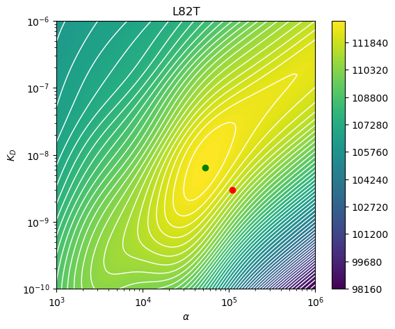
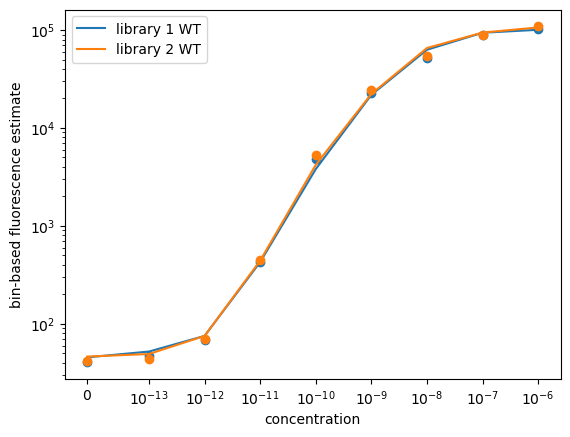

# Tite-seq modeling

## Set up analysis


```python
import yaml
# Immediatly Force JAX to use CPU
with open('config.yaml') as f:
    config = yaml.safe_load(f)

import os
import glob
os.environ['CUDA_VISIBLE_DEVICES'] = ''
os.environ['XLA_FLAGS'] = f'--xla_force_host_platform_device_count=1 --xla_cpu_multi_thread_eigen=false intra_op_parallelism_threads=1'

import warnings
warnings.simplefilter('ignore')

import jax
jax.config.update("jax_enable_x64", True)
import jax.numpy as jnp
from jax.scipy.special import expit as jexpit
import jaxopt

import numpy as np
import scipy
import pandas as pd
# import matplotlib
# matplotlib.use('Agg')
import matplotlib.pyplot as plt
# %matplotlib inline
import seaborn as sns

import fcsparser

```

## Data

Define concentrations and bins


```python
concs = np.array(config['concentrations']['CGG']).astype(float)
b = np.array(config['bins']['CGG'])
bins = np.array(range(1, len(b)))
bins, b
```


    (array([1, 2, 3, 4]),
     array([-2.88000e+02,  1.36000e+02,  2.00000e+03,  2.94210e+04,
             2.62143e+05]))


Load variant counts file


```python
df_variants = pd.read_csv(config['prepped_variant_counts_file']).query(f"sample.str.contains('TiteSeq')")
```

## Model elaborations


### Latent fluorescence

We sort cells at 9 concentrations $x_1, \ldots, x_9$.
For a cell of variant $i$, model the fluorescence $z_i$ at each concentration $x_j$ with a log-normal distribution:
$$
\log z_i\mid x_j \sim \mathcal{N}\left(\log f(x_i; \kappa_i, \alpha_i), \ σ^2\right),
$$
with median given by an affine function of antigen occupancy of the cell, which obeys Hill-Langmuir kinetics.
$$
f(x_j; \alpha_i, \beta, \kappa_i) = \alpha_i\left(\frac{x_j}{x_j + \kappa_i}\right) + \beta,
$$
where $\kappa_i$ is the dissociation constant ($K_D$) of variant $i$, $\alpha_i$ models the maximum fluorescence at saturation of variant $i$ (a function of the variant's surface expression of antibody), $\beta$ models a cell autofluorescence baseline, and $\sigma^2$ is the variance profile on the log-fluorescence scale.

### Fluorescence bins

We sort cells into 4 fluorescence bins, defined by the right-open intervals bounded by $b_0=0, b_1, b_2, b_3, b_4=\infty$.
The probability that a cell from variant $i$ sorted at concentration $x_j$ appears within a fluorescence bin defined by the interval $[b_{k-1}, b_k)$ is obtained by integrating the log-normal distribution over the bin interval:
$$
p_{ijk}(\alpha_i, \beta, \kappa_i, \sigma) = \Phi\left(\frac{\log b_k - \log f(x_j; \kappa_i, \alpha_i)}{\sigma}\right) - \Phi\left(\frac{\log b_{k-1} - \log f(x_j; \alpha_i, \beta, \kappa_i)}{\sigma}\right),
$$
where $\Phi$ is the CDF of the standard normal distribution.

### Compound counting process for cells and reads

Let parameter $\rho_i$ denote the library fraction of variant $i$.
We know the total number of cells $C_{jk}$ sorted at concentration $x_j$ and fluorescence bin $k$, so (by the Poissonization theorem) the number of cells of variant $i$ sorted at concentration $x_j$ and fluorescence bin $k$ is a random variable $C_{ijk}\sim\mathrm{Pois}(C_{jk} \rho_i p_{ijk})$. 

We additionally know the total number of reads $R_{jk}$ sequenced from cells sorted at concentration $x_j$ and fluorescence bin $k$. Conditioning on the number of cells $C_{ijk}$, the number of reads of variant $i$ sequenced from cells sorted at concentration $x_j$ and fluorescence bin $k$ is a random variable $Y_{ijk}\mid C_{ijk} \sim \mathrm{Pois}(R_{jk} C_{ijk})$.
The unconditional $Y_{ijk}$ is a compound Poisson random variable:
$$
Y_{ijk} = \sum_{\ell=1}^{C_{ijk}} Q_{ijk}^{(\ell)},
$$
where $Q_{ijk}^{(\ell)}\sim\mathrm{Pois}\left(\frac{R_{jk}}{C_{jk}}\right)$ is the number of reads from cell $\ell$ of variant $i$ sorted at concentration $x_j$ and fluorescence bin $k$.

The PMF for $Y_{ijk}$ is intractable, but we expect it will look like an over-dispersed Poisson distribution.
This motivates an approximation of $Y_{ijk}$ as a negative binomial random variable, with moments matched to the compound Poisson random variable, which are tractable.
Denote the Poisson intensity of cells of variant $i$ sorted at concentration $x_j$ and fluorescence bin $k$ as
$$
\lambda_{ijk}(\alpha_i, \beta, \kappa_i, \sigma) := C_{jk} \rho_i p_{ijk}(\alpha_i, \beta, \kappa_i, \sigma),
$$
and the Poisson intensity of reads per cell (read depth) at concentration $x_j$ and fluorescence bin $k$ as
$$
D_{jk} := \frac{R_{jk}}{C_{jk}}.
$$
After some calculation for the moments, we find the approximation
$$
Y_{ijk} \sim \mathrm{NB}\left(\lambda_{ijk}(\alpha_i, \beta, \kappa_i, \sigma), \frac{D_{jk}}{D_{jk} + 1}\right).
$$

### Likelihood

The log-likelihood given read count data tensor $Y\in\mathbb{N}^{n\times 9\times 4}$ is then
$$
\log \mathcal{L}(\boldsymbol\alpha, \beta, \boldsymbol\kappa, \sigma; Y) = \sum_{i=1}^n \sum_{j=1}^9 \sum_{k=1}^4 \left(\log\gamma(\lambda_{ijk}(\alpha_i, \beta, \kappa_i, \sigma) + Y_{ijk}) - \log\gamma(\lambda_{ijk}(\alpha_i, \beta, \kappa_i, \sigma)) + \lambda_{ijk}(\alpha_i, \beta, \kappa_i, \sigma) \log\left(\frac{D_{jk}}{D_{jk} + 1}\right)\right),
$$
where $\gamma$ denotes the gamma function.

### Constrained optimization

We must constrain the parameters to ensure that the predicted aggregate fluorescence of all variants matches the empirical FACS data.
We use the [augmented Lagrangian method](https://epubs.siam.org/doi/book/10.1137/1.9781611973365) with a generalized Kullback-Leibler divergence constraint on the aggregate fluorescence.
The constraint function is... **TODO**

## FACS data


```python
fcs_files = sorted(glob.glob(config['facs_file_pattern']))
fcs_files
```


    ['exptl_data/210624_TiteSeq_CGG/FCS_scFvpos/Specimen_001_sample_001_P4_006.fcs',
     'exptl_data/210624_TiteSeq_CGG/FCS_scFvpos/Specimen_001_sample_002_P4_007.fcs',
     'exptl_data/210624_TiteSeq_CGG/FCS_scFvpos/Specimen_001_sample_003_P4_008.fcs',
     'exptl_data/210624_TiteSeq_CGG/FCS_scFvpos/Specimen_001_sample_004_P4_009.fcs',
     'exptl_data/210624_TiteSeq_CGG/FCS_scFvpos/Specimen_001_sample_005_P4_010.fcs',
     'exptl_data/210624_TiteSeq_CGG/FCS_scFvpos/Specimen_001_sample_006_P4_011.fcs',
     'exptl_data/210624_TiteSeq_CGG/FCS_scFvpos/Specimen_001_sample_007_P4_012.fcs',
     'exptl_data/210624_TiteSeq_CGG/FCS_scFvpos/Specimen_001_sample_008_P4_013.fcs',
     'exptl_data/210624_TiteSeq_CGG/FCS_scFvpos/Specimen_001_sample_009_P4_014.fcs',
     'exptl_data/210624_TiteSeq_CGG/FCS_scFvpos/Specimen_001_sample_010_P4_015.fcs',
     'exptl_data/210624_TiteSeq_CGG/FCS_scFvpos/Specimen_001_sample_011_P4_016.fcs',
     'exptl_data/210624_TiteSeq_CGG/FCS_scFvpos/Specimen_001_sample_012_P4_017.fcs',
     'exptl_data/210624_TiteSeq_CGG/FCS_scFvpos/Specimen_001_sample_013_P4_018.fcs',
     'exptl_data/210624_TiteSeq_CGG/FCS_scFvpos/Specimen_001_sample_014_P4_019.fcs',
     'exptl_data/210624_TiteSeq_CGG/FCS_scFvpos/Specimen_001_sample_015_P4_020.fcs',
     'exptl_data/210624_TiteSeq_CGG/FCS_scFvpos/Specimen_001_sample_016_P4_021.fcs',
     'exptl_data/210624_TiteSeq_CGG/FCS_scFvpos/Specimen_001_sample_017_P4_022.fcs',
     'exptl_data/210624_TiteSeq_CGG/FCS_scFvpos/Specimen_001_sample_018_P4_023.fcs']


```python
fcs_df = pd.DataFrame()

pe_grid = np.logspace(np.log10(b[1]) - 2, np.log10(b[-1]), 25)
logf_grid = np.log(pe_grid)

logf_pdfs1 = np.full((len(concs), len(logf_grid)), np.nan)
logf_pdfs2 = np.full((len(concs), len(logf_grid)), np.nan)

for fcs_file in fcs_files:
    title_str = fcs_file.split("/")[-1].split(".")[0]
    sample_number = int(title_str.split("_")[3])
    library = (sample_number - 1) // len(concs) + 1
    meta, fcs = fcsparser.parse(fcs_file, reformat_meta=True)
    spill_values = meta["SPILL"].split(',')
    n_ch = int(spill_values[0])
    spill_df = pd.DataFrame(np.array(spill_values[(n_ch + 1):], dtype=np.float64).reshape((n_ch, n_ch)).T,
                            index=spill_values[1:(n_ch + 1)])
    fcs[spill_df.index] = np.linalg.solve(spill_df, fcs[spill_df.index].T).T
    fcs["sample"] = title_str
    concentration_idx = sample_number % len(concs) - 1
    fcs["library"] = library
    fcs["concentration"] = concs[concentration_idx]
    fcs_df = pd.concat(
        (fcs_df,
            fcs[["library",
                "sample",
                "concentration",
                "PE-A",
                ]
                ]
            ),
            ignore_index=True)
    
    # fcs["PE-A"] = np.clip(fcs["PE-A"], b[0], b[-1])

    not_truncated_idxs = np.where((fcs["PE-A"] > 0) & (fcs["PE-A"] < b[-1]))[0]
    kde = scipy.stats.gaussian_kde(
        np.log(fcs["PE-A"].values[not_truncated_idxs]),
        bw_method=.1)
    truncated_fraction = (fcs["PE-A"] >= b[-1]).sum() / len(fcs)
    if library == 1:
        logf_pdfs1[concentration_idx, :] = kde(logf_grid) #/ jax.scipy.integrate.trapezoid(kde(logf_grid), x=logf_grid)
    else:
        logf_pdfs2[concentration_idx, :] = kde(logf_grid) #/ jax.scipy.integrate.trapezoid(kde(logf_grid), x=logf_grid)
```


```python
g = sns.displot(
    data=fcs_df.loc[(fcs_df["PE-A"] >= np.exp(logf_grid)[0]) & (fcs_df["PE-A"] <= np.exp(logf_grid)[-1])],
    x="PE-A",
    row="concentration",
    col="library",
    bins=np.exp(logf_grid),
    # bins=np.concatenate((np.linspace(fcs_df["PE-A"].min(), 0, 10), np.logspace(1, 6, 100))),
    # bins=fcs_df["PE-A"].min() + np.logspace(1, 6, 100),
    # stat="frequency",
    stat="probability",
    common_norm=False,
    color="gray",
    height=1, aspect=4,
    facet_kws=dict(sharey=False),
    )

g.set_ylabels("")
g.set_titles("")

for i in range(g.axes.shape[0]):
    for j in range(g.axes.shape[1]):
        g.axes[i, j].plot(np.exp(logf_grid),
                          (logf_pdfs1 if j == 0 else logf_pdfs2)[len(concs)-i - 1, :] / (logf_pdfs1 if j == 0 else logf_pdfs2)[len(concs)-i - 1, :].sum(),
                          color="r", lw=2)
        for bi in b[1:]:
            g.axes[i, j].axvline(bi, color="g", clip_on=False, alpha=0.5, lw=2)
            if g.row_names[i] > 0:
                power = int(np.log10(g.row_names[i]))
                title = f"$[A] = 10^{{{power}}}$"
            else:
                title = "$[A] = 0$"
            g.axes[i, j].set_title(title,
                        fontsize='small',
                        loc='left',
                        x=0.05,
                        y=0.7,
                        )

plt.xscale("log")
plt.xlim(np.exp(logf_grid[0]), np.exp(logf_grid[-1]))
plt.tight_layout()
```


    

    


```python
plt.plot(np.exp(logf_grid), logf_pdfs1.T)
plt.xscale("log")
```


    

    


```python
fcs_df["PE-A"] < b[0]
```


    0         False
    1         False
    2         False
    3         False
    4         False
              ...  
    351067    False
    351068    False
    351069    False
    351070    False
    351071    False
    Name: PE-A, Length: 351072, dtype: bool


```python
meta, data = fcsparser.parse(fcs_file, reformat_meta=True)

spill_values = meta["SPILL"].split(',')
n = int(spill_values[0])  # The first item is the number of channels
spill_df = pd.DataFrame(np.array(spill_values[3:], dtype=np.float64).reshape((n, n)).T,
                        index=spill_values[1:3],
                        columns=spill_values[1:3])
spill_df

```


<div>
<style scoped>
    .dataframe tbody tr th:only-of-type {
        vertical-align: middle;
    }

    .dataframe tbody tr th {
        vertical-align: top;
    }

    .dataframe thead th {
        text-align: right;
    }
</style>
<table border="1" class="dataframe">
  <thead>
    <tr style="text-align: right;">
      <th></th>
      <th>PE-A</th>
      <th>FITC-A</th>
    </tr>
  </thead>
  <tbody>
    <tr>
      <th>PE-A</th>
      <td>1.0000</td>
      <td>0.003</td>
    </tr>
    <tr>
      <th>FITC-A</th>
      <td>0.0085</td>
      <td>1.000</td>
    </tr>
  </tbody>
</table>
</div>


```python
with pd.option_context("display.precision", 10):
    print("spillover matrix")
    display(spill_df)
    print("inverse spillover matrix")
    display(pd.DataFrame(np.linalg.inv(spill_df), index=spill_df.columns, columns=spill_df.columns))
```

    spillover matrix


<div>
<style scoped>
    .dataframe tbody tr th:only-of-type {
        vertical-align: middle;
    }

    .dataframe tbody tr th {
        vertical-align: top;
    }

    .dataframe thead th {
        text-align: right;
    }
</style>
<table border="1" class="dataframe">
  <thead>
    <tr style="text-align: right;">
      <th></th>
      <th>PE-A</th>
      <th>FITC-A</th>
    </tr>
  </thead>
  <tbody>
    <tr>
      <th>PE-A</th>
      <td>1.0000</td>
      <td>0.003</td>
    </tr>
    <tr>
      <th>FITC-A</th>
      <td>0.0085</td>
      <td>1.000</td>
    </tr>
  </tbody>
</table>
</div>


    inverse spillover matrix


<div>
<style scoped>
    .dataframe tbody tr th:only-of-type {
        vertical-align: middle;
    }

    .dataframe tbody tr th {
        vertical-align: top;
    }

    .dataframe thead th {
        text-align: right;
    }
</style>
<table border="1" class="dataframe">
  <thead>
    <tr style="text-align: right;">
      <th></th>
      <th>PE-A</th>
      <th>FITC-A</th>
    </tr>
  </thead>
  <tbody>
    <tr>
      <th>PE-A</th>
      <td>1.0000255007</td>
      <td>-0.0030000765</td>
    </tr>
    <tr>
      <th>FITC-A</th>
      <td>-0.0085002168</td>
      <td>1.0000255007</td>
    </tr>
  </tbody>
</table>
</div>


Spillover matrix mixes two true signals into two observed signals:
$$
\begin{pmatrix}
\mathrm{PE_{observed}} \\
\mathrm{FITC_{observed}} \\
\end{pmatrix}
=
\begin{pmatrix}
1 & 0.003 \\
0.0085 & 1 \\
\end{pmatrix}
\begin{pmatrix}
\mathrm{PE_{true}} \\
\mathrm{FITC_{true}} \\
\end{pmatrix}
$$
So to recover the true signals from the observed signals, we invert the matrix:
$$
\begin{align*}
\begin{pmatrix}
\mathrm{PE_{true}} \\
\mathrm{FITC_{true}} \\
\end{pmatrix}
&=
\begin{pmatrix}
1 & 0.003 \\
0.0085 & 1 \\
\end{pmatrix}^{-1}
\begin{pmatrix}
\mathrm{PE_{observed}} \\
\mathrm{FITC_{observed}} \\
\end{pmatrix}\\
&=
\begin{pmatrix}
1.0000255007 & -0.0030000765 \\
-0.0085002168 & 1.0000255007 \\
\end{pmatrix}
\begin{pmatrix}
\mathrm{PE_{observed}} \\
\mathrm{FITC_{observed}} \\
\end{pmatrix}
\end{align*}\\
$$


```python
fcs_df["$log_{10}$ PE-A"] = np.log10(fcs_df["PE-A"])
for yval in ("$log_{10}$ PE-A", "PE-A"):
    g = sns.catplot(data=fcs_df,
                    kind="boxen",
                    col="library",
                    x="concentration",
                    y=yval,
                    gap=.3,
                    height=3, aspect=1.5,
                )
    g.refline(x=6 + np.log10(4), color="r", linestyle='--', lw=2, label="BLI naive $K_D$")
    plt.tight_layout()
    plt.show()
```


    

    


    

    


```python
logf_pdfs1 = np.flip(logf_pdfs1, axis=0)
logf_pdfs2 = np.flip(logf_pdfs2, axis=0)
```

### Modeling functions


```python
# NOTE: assumes logx[0] = -inf
def f(logx, logα, logβ, logKd, logn):
    n = jnp.exp(logn)  # Hill coefficient
    logx = jnp.atleast_1d(logx)[:, None]
    logα = jnp.atleast_1d(logα)[None, :]
    logKd = jnp.atleast_1d(logKd)[None, :]
    result = jnp.exp(logβ) * jnp.ones((logx.shape[0], logα.shape[-1]))
    result = result.at[1:].add(jnp.exp(logα) * jexpit(n * (logx[1:] - logKd))).squeeze()
    return result

# NOTE: this function assumes truncation on the high bin, so all counts above it are in that bin (infinite upper boundary)
def logp(logx, logα, logβ, logKd, b, logσ, logn):
    fs = f(logx, logα, logβ, logKd, logn)
    σ = jnp.exp(logσ)
    logcdf_points = jax.scipy.stats.norm.logcdf(jnp.log(b[1:-1]), loc=jnp.log(fs[:, None]), scale=σ)
    logsf_points = jax.scipy.stats.norm.logsf(jnp.log(b[1:-1]), loc=jnp.log(fs[:, None]), scale=σ)
    first = logcdf_points[:, 0, None]
    middle = jax.scipy.special.logsumexp(jnp.concatenate((logcdf_points[:, 1:, None], logcdf_points[:, 0:-1, None]),
                                                       axis=-1),
                                       b=jnp.array([1, -1]),
                                       axis=-1)
    # this accounts for the fact that the last bin includes all values above the last boundary
    last = logsf_points[:, -1, None]
    return jnp.concatenate((first, middle, last), axis=-1)     

def p(logx, logα, logβ, logKd, b, logσ, logn):
    return jnp.exp(logp(logx, logα, logβ, logKd, b, logσ, logn))

@jax.jit
def one_neg_log_likelihood(logγ, logα, logKd, y, logβ, logσ, logx, b, cells, reads_per_cell, logn):
    # We have a compound poisson distribution for the read count in each (concentration, bin)
    # We match moments to the negative binomial distribution
    logp_ = logp(logx, logα, logβ, logKd, b, logσ, logn)
    # expected cell count matrix
    λ_cell = cells[:, None] * jnp.exp(logγ + logp_[None, :])
    nbinom_logp = - jnp.log1p(reads_per_cell)
    
    ll = jax.scipy.special.gammaln(λ_cell + y) - jax.scipy.special.gammaln(λ_cell) + λ_cell * nbinom_logp

    return -ll.sum()

vmap_one_neg_log_likelihood = jax.vmap(one_neg_log_likelihood, in_axes=(0, 0, 0, 0, None, None, None, None, None, None, None))

@jax.jit
def DKL(params, data):
    logγs, logαs, logKds, logσ, logn = params
    Y, wt_idx, logx, b, cells, reads_per_cell, logβ, logf_grid, logf_pdfs, single_mut_idxs, other_mut_idxs = data
    σ = jnp.exp(logσ)
    fs = f(logx, logαs, logβ, logKds, logn)
    logf_pdfs_predicted = jax.scipy.stats.norm.pdf(logf_grid[None, :, None], loc=jnp.log(fs[:, None, :]), scale=σ).mean(-1)
    return jax.scipy.integrate.trapezoid(jax.scipy.special.kl_div(logf_pdfs, logf_pdfs_predicted), x=logf_grid, axis=1).sum()

@jax.jit
def neg_log_likelihood(params, data,
                       μ=0.0,  # prior matching weight
                       λ=0.0,  # Lagrange multiplier estimate for Augmented Lagrangian iterates
                       γ_ridge=0.0, α_ridge=0.0, Kd_ridge=0.0,
                       ):
    logγs, logαs, logKds, logσ, logn = params
    Y, wt_idx, logx, b, cells, reads_per_cell, logβ, logf_grid, logf_pdfs, single_mut_idxs, other_mut_idxs = data
    logγs = logγs * jnp.ones(Y.shape[0])
    logαs = logαs * jnp.ones(Y.shape[0])
    logKds = logKds * jnp.ones(Y.shape[0])
    
    nll = vmap_one_neg_log_likelihood(logγs, logαs, logKds, Y, logβ, logσ, logx, b, cells, reads_per_cell, logn).mean()

    D = DKL(params, data)
    prior_penalty = (μ / 2) * D ** 2 + λ * D

    logγ_penalty = γ_ridge * (((logγs[single_mut_idxs] - logγs[single_mut_idxs].mean()) ** 2).sum() + ((logγs[other_mut_idxs] - logγs[other_mut_idxs].mean()) ** 2).sum())
    # logα_nonwt_mean = (logαs.sum() - logαs[wt_idx]) / (len(logαs) - 1)
    # logα_penalty = α_ridge * (((logαs - logα_nonwt_mean) ** 2).sum() - ((logαs[wt_idx] - logα_nonwt_mean) ** 2).sum())
    # logKd_nonwt_mean = (logKds.sum() - logKds[wt_idx]) / (len(logKds) - 1)
    # logKd_penalty = Kd_ridge * (((logKds - logKd_nonwt_mean) ** 2).sum() - ((logKds[wt_idx] - logKd_nonwt_mean) ** 2).sum())
    logα_penalty = α_ridge * ((logαs - logαs[wt_idx]) ** 2).sum()
    logKd_penalty = Kd_ridge * ((logKds - logKds[wt_idx]) ** 2).sum()

    return nll + logγ_penalty + logα_penalty + logKd_penalty + prior_penalty


@jax.jit
def one_mean_bin_loss(logα, logKd, ynorm, logβ, logσ, logx, b, binfs,
                      ):
    mean_bin_dat = (ynorm * binfs).sum(1) / ynorm.sum(1)
    ps = p(logx, logα, logβ, logKd, b, logσ)
    mean_bin_model = (ps * binfs).sum(1) / ps.sum(1)
    w = jnp.log(ynorm.sum(-1, keepdims=True))
    # w = jnp.ones(Ynorm.shape[1])
    curve_fit_loss = (w * (mean_bin_model - mean_bin_dat) ** 2).sum()
    return curve_fit_loss

vmap_mean_bin_loss = jax.vmap(one_mean_bin_loss, in_axes=(0, 0, 0, None, None, None, None, None,
                                                          ))

@jax.jit
def mean_bin_loss(params, data,
                  prior_weight=0.0,
                #   L2_logα=0.0, L2_logKd=0.0,
                  ):
    logαs, logKds, logσ = params
    Ynorm, logx, b, binfs, logβ, logf_grid, logf_pdfs = data
    # Ynorm, logx, b, binfs, ref_idx = data
    logαs = logαs * jnp.ones(Ynorm.shape[0])
    logKds = logKds * jnp.ones(Ynorm.shape[0])

    curve_fit_loss = vmap_mean_bin_loss(logαs, logKds, Ynorm, logβ, logσ, logx, b, binfs,
                                        ).mean()
    # return curve_fit_loss
    # return (curve_fit_loss
    #         + L2_logα * ((logαs - logαs[ref_idx]) ** 2).mean()
    #         + L2_logKd * ((logKds - logKds[ref_idx]) ** 2).mean()
    #         )
    σ = jnp.exp(logσ)
    fs = f(logx, logαs, logβ, logKds)
    logf_pdfs_predicted = jax.scipy.stats.norm.pdf(logf_grid[None, :, None], loc=jnp.log(fs[:, None, :]), scale=σ).mean(-1)
    logf_pdfs_predicted = logf_pdfs_predicted / jax.scipy.integrate.trapezoid(logf_pdfs_predicted, x=logf_grid, axis=1)[:, None]
    # plt.plot(logf_grid, logf_pdfs.T, c="C0")
    # plt.plot(logf_grid, logf_pdfs_predicted.T, c="C1")
    # plt.show()
    # print(jax.scipy.integrate.trapezoid(logf_pdfs, x=logf_grid, axis=1))
    # print(jax.scipy.integrate.trapezoid(logf_pdfs_predicted, x=logf_grid, axis=1))
    prior_loss = jax.scipy.integrate.trapezoid((logf_pdfs_predicted - logf_pdfs) ** 2, x=logf_grid, axis=1).sum()

    return curve_fit_loss + prior_weight * prior_loss

```

Read and cell count data


```python
barcode_runs = pd.read_csv(config['barcode_runs']).drop(columns=["R1"])
barcode_runs.query("sample.str.startswith('TiteSeq')", inplace=True)
barcode_runs.set_index(["library", "sample"], inplace=True)
barcode_runs.concentration = concs[barcode_runs.concentration.astype(int) - 1]
print(barcode_runs.shape)
barcode_runs.head()
```

    (72, 5)


<div>
<style scoped>
    .dataframe tbody tr th:only-of-type {
        vertical-align: middle;
    }

    .dataframe tbody tr th {
        vertical-align: top;
    }

    .dataframe thead th {
        text-align: right;
    }
</style>
<table border="1" class="dataframe">
  <thead>
    <tr style="text-align: right;">
      <th></th>
      <th></th>
      <th>sample_type</th>
      <th>sort_bin</th>
      <th>concentration</th>
      <th>date</th>
      <th>number_cells</th>
    </tr>
    <tr>
      <th>library</th>
      <th>sample</th>
      <th></th>
      <th></th>
      <th></th>
      <th></th>
      <th></th>
    </tr>
  </thead>
  <tbody>
    <tr>
      <th rowspan="5" valign="top">lib1</th>
      <th>TiteSeq_01_bin1</th>
      <td>TiteSeq</td>
      <td>1</td>
      <td>1.000000e-06</td>
      <td>210624</td>
      <td>9967</td>
    </tr>
    <tr>
      <th>TiteSeq_01_bin2</th>
      <td>TiteSeq</td>
      <td>2</td>
      <td>1.000000e-06</td>
      <td>210624</td>
      <td>100694</td>
    </tr>
    <tr>
      <th>TiteSeq_01_bin3</th>
      <td>TiteSeq</td>
      <td>3</td>
      <td>1.000000e-06</td>
      <td>210624</td>
      <td>910229</td>
    </tr>
    <tr>
      <th>TiteSeq_01_bin4</th>
      <td>TiteSeq</td>
      <td>4</td>
      <td>1.000000e-06</td>
      <td>210624</td>
      <td>4152079</td>
    </tr>
    <tr>
      <th>TiteSeq_02_bin1</th>
      <td>TiteSeq</td>
      <td>1</td>
      <td>1.000000e-07</td>
      <td>210624</td>
      <td>78772</td>
    </tr>
  </tbody>
</table>
</div>


```python
R_df = df_variants.rename(columns={"antigen_concentration": "concentration",
                                   "read_count": "number_reads"}).groupby(["library", "concentration", "bin"]).number_reads.sum().sort_index()
C_df = barcode_runs.reset_index().rename(columns={"sort_bin": "bin"}).set_index(["library", "concentration", "bin"]).number_cells.sort_index()
assert C_df.index.equals(R_df.index)

counts_df = pd.concat((R_df, C_df), axis=1, verify_integrity=True)

counts_df
```


<div>
<style scoped>
    .dataframe tbody tr th:only-of-type {
        vertical-align: middle;
    }

    .dataframe tbody tr th {
        vertical-align: top;
    }

    .dataframe thead th {
        text-align: right;
    }
</style>
<table border="1" class="dataframe">
  <thead>
    <tr style="text-align: right;">
      <th></th>
      <th></th>
      <th></th>
      <th>number_reads</th>
      <th>number_cells</th>
    </tr>
    <tr>
      <th>library</th>
      <th>concentration</th>
      <th>bin</th>
      <th></th>
      <th></th>
    </tr>
  </thead>
  <tbody>
    <tr>
      <th rowspan="5" valign="top">lib1</th>
      <th rowspan="4" valign="top">0.000000e+00</th>
      <th>1</th>
      <td>10601523</td>
      <td>4994518</td>
    </tr>
    <tr>
      <th>2</th>
      <td>100474</td>
      <td>97766</td>
    </tr>
    <tr>
      <th>3</th>
      <td>243</td>
      <td>156</td>
    </tr>
    <tr>
      <th>4</th>
      <td>38</td>
      <td>57</td>
    </tr>
    <tr>
      <th>1.000000e-13</th>
      <th>1</th>
      <td>1884022</td>
      <td>4879499</td>
    </tr>
    <tr>
      <th>...</th>
      <th>...</th>
      <th>...</th>
      <td>...</td>
      <td>...</td>
    </tr>
    <tr>
      <th rowspan="5" valign="top">lib2</th>
      <th>1.000000e-07</th>
      <th>4</th>
      <td>6040527</td>
      <td>3595640</td>
    </tr>
    <tr>
      <th rowspan="4" valign="top">1.000000e-06</th>
      <th>1</th>
      <td>1599</td>
      <td>5023</td>
    </tr>
    <tr>
      <th>2</th>
      <td>138268</td>
      <td>85666</td>
    </tr>
    <tr>
      <th>3</th>
      <td>1719136</td>
      <td>910355</td>
    </tr>
    <tr>
      <th>4</th>
      <td>5039341</td>
      <td>4087566</td>
    </tr>
  </tbody>
</table>
<p>72 rows × 2 columns</p>
</div>


Jax data from pandas frames


```python
cells1 = counts_df.loc["lib1"].reset_index().pivot(index="concentration", columns="bin", values="number_cells")
cells2 = counts_df.loc["lib2"].reset_index().pivot(index="concentration", columns="bin", values="number_cells")

reads1 = counts_df.loc["lib1"].reset_index().pivot(index="concentration", columns="bin", values="number_reads")
reads2 = counts_df.loc["lib2"].reset_index().pivot(index="concentration", columns="bin", values="number_reads")

reads_per_cell1 = reads1 / cells1
reads_per_cell2 = reads2 / cells2

sns.heatmap(cells1)
plt.show()
# plt.savefig(f"{output}/cells1.pdf")
sns.heatmap(cells2)
plt.show()
# plt.savefig(f"{output}/cells2.pdf")

sns.heatmap(reads1)
plt.show()
# plt.savefig(f"{output}/reads1.pdf")
sns.heatmap(reads2)
plt.show()
# plt.savefig(f"{output}/reads2.pdf")

sns.heatmap(reads_per_cell1)
plt.show()
# plt.savefig(f"{output}/reads_per_cell1.pdf")
sns.heatmap(reads_per_cell2)
plt.show()
# plt.savefig(f"{output}/reads_per_cell2.pdf")
```


    

    


    

    


    

    


    

    


    

    


    

    


```python
x = np.flip(concs)
logx = np.log(x)
libs = []
variants = []
variant_types = []
n_aa_substitutions = []
Y = []
bcs = []
Ynorm = []
for idx, ((lib, variant, n_aa_substitution), group_df) in enumerate(df_variants.groupby(["library", "variant", "n_aa_substitutions"])):
    # print(group_df.read_count.values)
    # break
    y = group_df.read_count.values.reshape(len(x), -1)
    ynorm = group_df.estimated_cell_count.values.reshape(len(x), -1)
    libs.append(lib)
    variants.append(variant)
    if "*" in variant:
        variant_types.append("nonsense")
    elif variant != "WT":
        if n_aa_substitution == 1:
            variant_types.append(f"1 missense")
        elif n_aa_substitution > 1:
            variant_types.append(f">1 missense")
        else:
            raise ValueError
    else:
        variant_types.append("WT")
    n_aa_substitutions.append(n_aa_substitution)
    Y.append(y)
    assert len(group_df.barcode.unique()) == 1, group_df.barcode
    bcs.append(float(group_df.barcode.unique().squeeze()))
    Ynorm.append(ynorm)
libs = np.array(libs)
variants = np.array(variants)
variant_types = np.array(variant_types)
n_aa_substitutions = np.array(n_aa_substitutions)
Y = np.array(Y)
bcs = np.array(bcs)
Ynorm = np.array(Ynorm)

assert Y.shape == Ynorm.shape

Y.shape
```


    (19637, 9, 4)


Distribution of normalized read counts per variant


```python
sns.histplot(x=Y.sum(-1).sum(-1),
             hue=variant_types,
             multiple="stack",
             log_scale=True)
plt.xlabel("read count")
plt.ylabel("number of variants")
plt.show()
# plt.savefig(f"{output}/variant_read_counts_before_filter_hist.pdf")

sns.histplot(x=bcs,
             hue=variant_types,
             multiple="stack",
             log_scale=True)
plt.xlabel("# barcodes")
plt.ylabel("number of variants")
plt.show()
# plt.savefig(f"{output}/variant_n_barcodes_before_filter_hist.pdf")
```


    

    


    

    


## Filter variants with low read counts

We sum the read counts for each variant across all bins and concentrations, then proceed to filter out variants where this sum of counts is < 100


```python
filter_idxs = (Y.sum((1, 2)) >= config['min_Titeseq_reads_per_variant'])
Y = Y[filter_idxs]
Ynorm = Ynorm[filter_idxs]
libs = libs[filter_idxs]
variants = variants[filter_idxs]
variant_types = variant_types[filter_idxs]
n_aa_substitutions = n_aa_substitutions[filter_idxs]
bcs = bcs[filter_idxs]

Y.shape
```


    (19579, 9, 4)


```python
sns.histplot(x=Y.sum(-1).sum(-1),
             hue=variant_types,
             multiple="stack",
             log_scale=True)
plt.xlabel("read count")
plt.ylabel("number of variants")
plt.show()

sns.histplot(x=bcs,
             hue=variant_types,
             multiple="stack",
             log_scale=True)
plt.xlabel("# barcodes")
plt.ylabel("number of variants")
plt.show()
```


    

    


    

    


## modeling

indices of WT


```python
wt_idx1, wt_idx2 = np.where(variants == "WT")[0]

libs[wt_idx1], variants[wt_idx1], libs[wt_idx2], variants[wt_idx2]
```


    ('lib1', 'WT', 'lib2', 'WT')


indices of libraries


```python
lib1_idxs = np.where(libs == "lib1")[0]
lib2_idxs = np.where(libs == "lib2")[0]
```

Initialize parameters


```python
def binfs_fn(df):
    result = pd.Series([np.log(df["PE-A"].loc[df["PE-A"] < b[1]]).mean(),
            np.log(df["PE-A"].loc[(df["PE-A"] >= b[1]) & (df["PE-A"] < b[2])]).mean(),
            np.log(df["PE-A"].loc[(df["PE-A"] >= b[2]) & (df["PE-A"] < b[3])]).mean(),
            np.log(df["PE-A"].loc[df["PE-A"] >= b[3]]).mean()],
            index=bins,
    )
    if pd.isna(result[1]):
        result[1] = np.log(b[1] / 2)
    if pd.isna(result[2]):
        result[2] = np.log(b[1] + (b[2] - b[1]) / 2)
    if pd.isna(result[3]):
        result[3] = np.log(b[2] + (b[3] - b[2]) / 2)
    if pd.isna(result[4]):
        result[4] = np.log(b[3] + (b[4] - b[3]) / 2)
    return result

binfs1 = fcs_df.query("library == 1").groupby("concentration").apply(binfs_fn).values
binfs2 = fcs_df.query("library == 2").groupby("concentration").apply(binfs_fn).values
binfs1, binfs2
```


    (array([[ 3.67535567,  5.1029518 ,  8.84928666, 11.88986763],
            [ 3.8027649 ,  5.1255578 ,  9.66208456, 11.88986763],
            [ 3.96695796,  5.30006393,  7.83393444, 11.88986763],
            [ 4.05794371,  6.20638973,  8.06921064, 11.88986763],
            [ 4.21443269,  6.43628639,  8.79475605, 10.65593872],
            [ 3.94763998,  6.44813809,  9.27926545, 10.86366992],
            [ 3.96291979,  6.51484936,  9.23536877, 11.27990724],
            [ 4.02359372,  6.66549913,  9.19591443, 11.62314663],
            [ 3.56925577,  7.00021358,  9.3050182 , 11.68026997]]),
     array([[ 3.70144604,  5.10336554,  9.66208456, 11.88986763],
            [ 3.74420994,  5.12493838,  9.66208456, 11.88986763],
            [ 3.97271008,  5.27766209,  7.74602864, 11.88986763],
            [ 4.08805716,  6.20576978,  8.07307964, 11.88986763],
            [ 4.25937259,  6.39374475,  8.83492159, 10.65256475],
            [ 3.97367315,  6.43588833,  9.22710318, 10.87296893],
            [ 3.95195404,  6.52715668,  9.21514817, 11.30047172],
            [ 4.02912882,  6.67754214,  9.16329729, 11.61356935],
            [ 4.11517258,  6.94800127,  9.28062366, 11.72562106]]))


```python
def mean_bin_fn(df):
    library = df.library.unique().squeeze()
    if library == "lib1":
        binfs = binfs1
    elif library == "lib2":
        binfs = binfs2
    else:
        raise ValueError(library)
    concentration = df.antigen_concentration.unique().squeeze()
    concentration_idx = np.where(x == concentration)[0].squeeze()
    return np.exp(np.average(binfs[concentration_idx], weights=df.estimated_cell_count))

mean_bin_variants = (
    df_variants
    .groupby(["library", "variant", "n_aa_substitutions", "antigen_concentration"]) # TODO remove after development
    .apply(mean_bin_fn)
    .to_frame()
    .reset_index()
    .rename(columns={0: "bin_based_fluorescence"})
)

display(mean_bin_variants)
```


<div>
<style scoped>
    .dataframe tbody tr th:only-of-type {
        vertical-align: middle;
    }

    .dataframe tbody tr th {
        vertical-align: top;
    }

    .dataframe thead th {
        text-align: right;
    }
</style>
<table border="1" class="dataframe">
  <thead>
    <tr style="text-align: right;">
      <th></th>
      <th>library</th>
      <th>variant</th>
      <th>n_aa_substitutions</th>
      <th>antigen_concentration</th>
      <th>bin_based_fluorescence</th>
    </tr>
  </thead>
  <tbody>
    <tr>
      <th>0</th>
      <td>lib1</td>
      <td>A104C</td>
      <td>1</td>
      <td>0.000000e+00</td>
      <td>40.549975</td>
    </tr>
    <tr>
      <th>1</th>
      <td>lib1</td>
      <td>A104C</td>
      <td>1</td>
      <td>1.000000e-13</td>
      <td>46.202822</td>
    </tr>
    <tr>
      <th>2</th>
      <td>lib1</td>
      <td>A104C</td>
      <td>1</td>
      <td>1.000000e-12</td>
      <td>64.519605</td>
    </tr>
    <tr>
      <th>3</th>
      <td>lib1</td>
      <td>A104C</td>
      <td>1</td>
      <td>1.000000e-11</td>
      <td>437.686913</td>
    </tr>
    <tr>
      <th>4</th>
      <td>lib1</td>
      <td>A104C</td>
      <td>1</td>
      <td>1.000000e-10</td>
      <td>5156.312588</td>
    </tr>
    <tr>
      <th>...</th>
      <td>...</td>
      <td>...</td>
      <td>...</td>
      <td>...</td>
      <td>...</td>
    </tr>
    <tr>
      <th>176728</th>
      <td>lib2</td>
      <td>Y94W R145M</td>
      <td>2</td>
      <td>1.000000e-10</td>
      <td>598.092095</td>
    </tr>
    <tr>
      <th>176729</th>
      <td>lib2</td>
      <td>Y94W R145M</td>
      <td>2</td>
      <td>1.000000e-09</td>
      <td>14580.818394</td>
    </tr>
    <tr>
      <th>176730</th>
      <td>lib2</td>
      <td>Y94W R145M</td>
      <td>2</td>
      <td>1.000000e-08</td>
      <td>23880.507519</td>
    </tr>
    <tr>
      <th>176731</th>
      <td>lib2</td>
      <td>Y94W R145M</td>
      <td>2</td>
      <td>1.000000e-07</td>
      <td>52046.775140</td>
    </tr>
    <tr>
      <th>176732</th>
      <td>lib2</td>
      <td>Y94W R145M</td>
      <td>2</td>
      <td>1.000000e-06</td>
      <td>123700.804051</td>
    </tr>
  </tbody>
</table>
<p>176733 rows × 5 columns</p>
</div>


```python
logα = np.log(1.1e5)
logKd = np.log(3e-9)
logσ = 0.0
logn = 0.0

logβ = np.log(fcs_df.query("library == 1 & concentration == 0")["PE-A"].median())

logγ = np.log(bcs[wt_idx1] / bcs[lib1_idxs].sum())

x_grid = np.array([0] + list(np.logspace(np.log10(x[1]), np.log10(x[-1]), 100)))
logx_grid = np.log(x_grid)
fs = f(logx_grid, logα, logβ, logKd, logn)
scale = np.exp(logσ)
q25 = scipy.stats.lognorm.ppf(0.25, s=scale, scale=fs)
q75 = scipy.stats.lognorm.ppf(0.75, s=scale, scale=fs)
plt.fill_between(x_grid,
                 q25,
                 q75,
                 color="lightgray",
                 label="IQR")
plt.plot(x_grid, fs, label="median")
for b_ in b:
    plt.axhline(b_, color="k", linestyle="--")
plt.xscale("symlog", linthresh=x[1], linscale=0.3)
plt.yscale("log")
plt.ylim(b[0], b[-1])
plt.xlabel("concentration")
plt.ylabel("fluorescence")
plt.xlim(x[0], x[-1])
plt.ylim(fs[0], q75[-1])
plt.legend()
plt.show()
# plt.savefig(f"{output}/model_median_iqr_line.pdf")

ps = p(logx, logα, logβ, logKd, b, logσ, logn)
mean_binf1 = np.exp((binfs1 * ps).sum(1) / ps.sum(1))
mean_binf2 = np.exp((binfs2 * ps).sum(1) / ps.sum(1))
mean_binf_wt1 = np.exp((binfs1 * Ynorm[wt_idx1]).sum(1) / Ynorm[wt_idx1].sum(1))
mean_binf_wt2 = np.exp((binfs2 * Ynorm[wt_idx2]).sum(1) / Ynorm[wt_idx2].sum(1))

plt.plot(x, mean_binf1, label="expected", c="C0")
plt.plot(x, mean_binf2, label="expected", c="C1")
plt.plot(x, mean_binf_wt1, "o", label="WT (lib1)", alpha=0.5, c="C0")
plt.plot(x, mean_binf_wt2, "o", label="WT (lib2)", alpha=0.5, c="C1")
plt.xscale("symlog", linthresh=1e-13)
plt.yscale("log")
plt.xlabel("concentration")
plt.ylabel("bin-based fluorescence estimate")
plt.legend()
plt.show()
# plt.savefig(f"{output}/bin_based_fluorescence_estimate_line.pdf")

logps = logp(logx, logα, logβ, logKd, b, logσ, logn)

# expected read count matrix
exp_cell_df = pd.DataFrame((reads_per_cell1 * cells1.values.sum(1, keepdims=True) * np.exp(logγ + logps)).T, columns=x, index=bins)
plt.figure(figsize=(4, 2))
ax = sns.heatmap(exp_cell_df, cmap="viridis")
ax.invert_yaxis()
plt.title(f"model (lib1)")
plt.show()
# plt.savefig(f"{output}/model_lib1_expected_counts_heatmap.pdf")

read_df = pd.DataFrame(Y[wt_idx1].T, columns=pd.Series(x, name="concentration"), index=pd.Series(bins, name="bin"))
plt.figure(figsize=(4, 2))
ax = sns.heatmap(read_df, cmap="viridis")
ax.invert_yaxis()
plt.title(f"WT (lib1)")
plt.show()
# plt.savefig(f"{output}/WT_lib1_read_counts_heatmap.pdf")
```

    An NVIDIA GPU may be present on this machine, but a CUDA-enabled jaxlib is not installed. Falling back to cpu.


    

    


    

    


    

    


    

    


Loss surface for WT


```python
for ct, (wt_idx, logf_pdfs, binfs) in enumerate(zip((wt_idx1, wt_idx2),
                                                    (logf_pdfs1, logf_pdfs2),
                                                    (binfs1, binfs2)),
                                                          1):
    # plot loss surface for Kd and α on one sample
    αs = np.exp(logα) * np.logspace(-1, 1, 100)
    Kds = np.exp(logKd) * np.logspace(-1, 1, 100)
    # αs, Kds = np.meshgrid(αs, Kds)
    loss = np.zeros((Kds.shape[0], αs.shape[0]))
    for i in range(Kds.shape[0]):
        for j in range(αs.shape[0]):
            loss[i, j] = one_neg_log_likelihood(logγ, np.log(αs[j]), np.log(Kds[i]), Y[wt_idx],
                                                logβ, logσ, logx, b, cells1.values, reads_per_cell1.values, logn)

    plt.figure(figsize=(4, 4))
    plt.contour(αs, Kds, loss, levels=100)
    plt.plot(np.exp(logα), np.exp(logKd), "o", color="r")
    plt.xlabel("$\\alpha$")
    plt.ylabel("$K_D$")
    plt.xscale("log")
    plt.yscale("log")
    plt.title(f"WT (lib{ct})")
    plt.show()
```


    

    


    

    


Form data and params for optimizations


```python
single_mut_idxs = (n_aa_substitutions == 1) & (variant_types != "nonsense")
other_mut_idxs = (n_aa_substitutions > 1) | (variant_types == "nonsense")
assert sum(single_mut_idxs) + sum(other_mut_idxs) == len(n_aa_substitutions) - 2
```


```python
data1 = Y[lib1_idxs], wt_idx1, logx, b, cells1.values.sum(1), reads_per_cell1.values, np.log(fcs_df.query("library == 1 & concentration == 0")["PE-A"]).median(), logf_grid, logf_pdfs1, np.where(single_mut_idxs[lib1_idxs])[0], np.where(other_mut_idxs[lib1_idxs])[0]
data2 = Y[lib2_idxs], wt_idx2 - len(lib1_idxs), logx, b, cells2.values.sum(1), reads_per_cell2.values, np.log(fcs_df.query("library == 2 & concentration == 0")["PE-A"]).median(), logf_grid, logf_pdfs2, np.where(single_mut_idxs[lib2_idxs])[0], np.where(other_mut_idxs[lib2_idxs])[0]
```

$$
p(z\mid \alpha, \beta, K_D, \sigma^2)
$$

$$
\begin{align*}
p(\alpha, \beta, \gamma, \kappa, \sigma, Z, Y) &= p(\alpha, \beta, \gamma, \kappa, \sigma \mid Z, Y) \ p(Z, Y)\\
&= p(\alpha, \beta, \gamma, \kappa, \sigma \mid z, y) \ p(Y \mid Z) p(Z)
\end{align*}
$$


```python
opt = jaxopt.ScipyBoundedMinimize(
    fun=neg_log_likelihood,
    method="l-bfgs-b",
    maxiter=1000, # 1000
    tol=1e-12,
    options=dict(
        maxls=100, # 100
        maxcor=10000, # 10000
    ),
    jit=True,
)
```


```python
params1 = [jnp.log(bcs[lib1_idxs] / bcs[lib1_idxs].sum()),
           logα * jnp.ones(len(lib1_idxs)),
           logKd * jnp.ones(len(lib1_idxs)),
           jnp.asarray(logσ),
           jnp.asarray(logn),
           ]
params2 = [jnp.log(bcs[lib2_idxs] / bcs[lib2_idxs].sum()),
           logα * jnp.ones(len(lib2_idxs)),
           logKd * jnp.ones(len(lib2_idxs)),
           jnp.asarray(logσ),
           jnp.asarray(logn),
           ]
```


```python
def bounds(params):
    lb = [
          jnp.full_like(params[0], -20),
          jnp.full_like(params[1], logα - 6),
          jnp.full_like(params[2], jnp.log(1e-12)),
          jnp.array(-0.75),
          jnp.array(-1.0),
          ]
    ub = [
          jnp.full_like(params[0], 0),
          jnp.full_like(params[1], logα + 6),
          jnp.full_like(params[2], jnp.log(1e-4)),
          jnp.array(0.75),
          jnp.array(1.0),
          ]
    return lb, ub
```


```python
jax.grad(neg_log_likelihood)(params1, data1)
```


    [Array([ 0.13800325,  0.02854429,  0.03538212, ..., -0.02237178,
            -0.01040843,  0.01130199], dtype=float64),
     Array([ 0.01480831,  0.00826123, -0.00047431, ...,  0.0157057 ,
            -0.00300895,  0.23824267], dtype=float64),
     Array([-0.01466567, -0.00454132, -0.00091075, ..., -0.0107503 ,
             0.00331897, -0.17355083], dtype=float64),
     Array(27.27801444, dtype=float64, weak_type=True),
     Array(-1029.74222251, dtype=float64, weak_type=True)]


```python
γ_ridge = 1e-2
α_ridge = 1e-3
Kd_ridge = 1e-3

λ1 = 1e-3
λ2 = 1e-3
for μ in np.logspace(-2, 2, 10): # 10
    print(f"{μ=:.1e}", flush=True)
    print(f"  {λ1=:.1e}")
    params1, state1 = opt.run(
        params1,
        bounds(params1),
        data1,
        μ=μ, λ=λ1,
        γ_ridge=γ_ridge, α_ridge=α_ridge, Kd_ridge=Kd_ridge,
        )
    D1 = DKL(params1, data1)
    λ1 += μ * D1
    error1 = opt.l2_optimality_error(params1,
                                     bounds(params1),
                                     data1, μ=μ, λ=λ1, γ_ridge=γ_ridge, α_ridge=α_ridge, Kd_ridge=Kd_ridge)
    obj1 = neg_log_likelihood(params1, data1, μ=μ, λ=λ1, γ_ridge=γ_ridge, α_ridge=α_ridge, Kd_ridge=Kd_ridge)
    print(f"    {state1.iter_num} iterations, success={state1.success}")
    print(f"    error={error1:.2e}")
    print(f"    obj={obj1:.2e}")
    print(f"    DKL={D1:.2e}")

    print(f"  {λ2=:.1e}")
    params2, state2 = opt.run(
        params2,
        bounds(params2),
        data2,
        μ=μ, λ=λ2,
        γ_ridge=γ_ridge, α_ridge=α_ridge, Kd_ridge=Kd_ridge,
        )
    D2 = DKL(params2, data2)
    λ2 += μ * D2
    error2 = opt.l2_optimality_error(params2,
                                     bounds(params2),
                                     data2, μ=μ, λ=λ2, γ_ridge=γ_ridge, α_ridge=α_ridge, Kd_ridge=Kd_ridge)
    obj2 = neg_log_likelihood(params2, data2, μ=μ, λ=λ2, γ_ridge=γ_ridge, α_ridge=α_ridge, Kd_ridge=Kd_ridge)
    print(f"    {state2.iter_num} iterations, success={state2.success}")
    print(f"    error={error2:.2e}")
    print(f"    obj={obj2:.2e}")
    print(f"    DKL={D2:.2e}")
```

    μ=1.0e-02


      λ1=1.0e-03


        725 iterations, success=True
        error=3.53e-02
        obj=-7.18e+04
        DKL=1.12e+00
      λ2=1.0e-03


        626 iterations, success=True
        error=6.89e-02
        obj=-5.00e+04
        DKL=1.64e+00
    μ=2.8e-02


      λ1=1.2e-02


        4 iterations, success=True
        error=9.80e-02
        obj=-7.18e+04
        DKL=1.12e+00
      λ2=1.7e-02


        130 iterations, success=True
        error=1.88e-01
        obj=-5.00e+04
        DKL=1.63e+00
    μ=7.7e-02


      λ1=4.3e-02


        5 iterations, success=True
        error=2.86e-01
        obj=-7.18e+04
        DKL=1.12e+00
      λ2=6.3e-02


        105 iterations, success=True
        error=5.20e-01
        obj=-5.00e+04
        DKL=1.63e+00
    μ=2.2e-01


      λ1=1.3e-01


        227 iterations, success=True
        error=7.46e-01
        obj=-7.18e+04
        DKL=1.11e+00
      λ2=1.9e-01


        372 iterations, success=True
        error=1.39e+00
        obj=-5.00e+04
        DKL=1.60e+00
    μ=6.0e-01


      λ1=3.7e-01


        147 iterations, success=True
        error=1.44e+00
        obj=-7.18e+04
        DKL=1.09e+00
      λ2=5.3e-01


        680 iterations, success=True
        error=1.57e+00
        obj=-5.00e+04
        DKL=1.54e+00
    μ=1.7e+00


      λ1=1.0e+00


        627 iterations, success=True
        error=1.48e+00
        obj=-7.18e+04
        DKL=1.04e+00
      λ2=1.5e+00


        755 iterations, success=True
        error=1.56e+00
        obj=-5.00e+04
        DKL=1.41e+00
    μ=4.6e+00


      λ1=2.8e+00


        467 iterations, success=True
        error=1.48e+00
        obj=-7.18e+04
        DKL=9.45e-01
      λ2=3.8e+00


        567 iterations, success=True
        error=1.55e+00
        obj=-5.00e+04
        DKL=1.21e+00
    μ=1.3e+01


      λ1=7.1e+00


        722 iterations, success=True
        error=1.48e+00
        obj=-7.18e+04
        DKL=8.12e-01
      λ2=9.4e+00


        713 iterations, success=True
        error=1.54e+00
        obj=-5.00e+04
        DKL=9.76e-01
    μ=3.6e+01


      λ1=1.8e+01


        889 iterations, success=True
        error=1.48e+00
        obj=-7.17e+04
        DKL=6.69e-01
      λ2=2.2e+01


        812 iterations, success=True
        error=1.53e+00
        obj=-4.99e+04
        DKL=7.73e-01
    μ=1.0e+02


      λ1=4.2e+01


        705 iterations, success=True
        error=1.49e+00
        obj=-7.17e+04
        DKL=5.56e-01
      λ2=5.0e+01


        878 iterations, success=True
        error=1.52e+00
        obj=-4.99e+04
        DKL=6.39e-01


```python
params1, params2
```


    ([Array([ -8.36468334, -12.01288156, -12.09358096, ..., -10.84783101,
             -11.26084972,  -7.8638363 ], dtype=float64),
      Array([11.35459483, 11.79655185, 12.04083282, ..., 11.24829297,
             11.80022826, 11.12104811], dtype=float64),
      Array([-19.97584456, -19.69092641, -19.86175753, ..., -18.57577271,
             -20.10492621, -19.51776902], dtype=float64),
      Array(-0.25072091, dtype=float64),
      Array(0.01446219, dtype=float64)],
     [Array([ -8.73026179,  -8.02059392, -12.09844065, ..., -11.4876509 ,
              -7.43227149, -11.95294006], dtype=float64),
      Array([11.39194604, 11.2257422 , 12.06556082, ..., 12.1163389 ,
             11.11624492, 11.88817798], dtype=float64),
      Array([-19.9809246 , -19.63245899, -19.91183776, ..., -20.37965586,
             -19.66547778, -19.94929061], dtype=float64),
      Array(-0.291543, dtype=float64),
      Array(0.02309911, dtype=float64)])


```python
plt.figure(figsize=(12, 8))
plt.subplot(231)
sns.histplot(x=np.exp(params1[0]),
             hue=variant_types[lib1_idxs],
             hue_order=("1 missense", ">1 missense", "nonsense"),
             log_scale=True,
             stat="probability",
            #  common_norm=False,
            #  bins=np.linspace(2, 6, 100),
             element="step",
             )
plt.axvline(np.exp(params1[0][wt_idx1]), color="k", linestyle="--")
plt.title("library 1")
plt.subplot(234)
sns.histplot(x=np.exp(params2[0]),
             hue=variant_types[lib2_idxs],
             hue_order=("1 missense", ">1 missense", "nonsense"),
             log_scale=True,
             stat="probability",
             element="step",
             legend=False,
             )
plt.axvline(np.exp(params2[0][wt_idx2 - len(lib1_idxs)]), color="k", linestyle="--")
plt.title("library 2")
plt.xlabel("$\\gamma$")
plt.subplot(232)
sns.histplot(x=np.exp(params1[1]),
             hue=variant_types[lib1_idxs],
             hue_order=("1 missense", ">1 missense", "nonsense"),
             log_scale=True,
             stat="probability",
             element="step",
             )
plt.axvline(np.exp(params1[1][wt_idx1]), color="k", linestyle="--")
plt.title("library 1")
plt.subplot(235)
sns.histplot(x=np.exp(params2[1]),
             hue=variant_types[lib2_idxs],
             hue_order=("1 missense", ">1 missense", "nonsense"),
             log_scale=True,
             stat="probability",
             element="step",
             legend=False,
             )
plt.axvline(np.exp(params2[1][wt_idx2 - len(lib1_idxs)]), color="k", linestyle="--")
plt.title("library 2")
plt.xlabel("$\\alpha$")
plt.subplot(233)
sns.histplot(x=np.exp(params1[2]),
             hue=variant_types[lib1_idxs],
             hue_order=("1 missense", ">1 missense", "nonsense"),
             log_scale=True,
             stat="probability",
             element="step",
             legend=False,
             )
plt.title("library 1")
plt.axvline(np.exp(params1[2][wt_idx1]), color="k", linestyle="--")
plt.subplot(236)
sns.histplot(x=np.exp(params2[2]),
             hue=variant_types[lib2_idxs],
             hue_order=("1 missense", ">1 missense", "nonsense"),
             log_scale=True,
             stat="probability",
             element="step",
             legend=False,
             )
plt.axvline(np.exp(params2[2][wt_idx2 - len(lib1_idxs)]), color="k", linestyle="--")
plt.title("library 2")
plt.xlabel("$K_D$")
plt.tight_layout()
plt.show()
```


    

    


```python
for datai, paramsi, wt_idxi, variantsi, variant_typesi in zip((data1, data2),
                                      (params1, params2),
                                      (wt_idx1, wt_idx2 - len(lib1_idxs)),
                                      (variants[lib1_idxs], variants[lib2_idxs]),
                                      (variant_types[lib1_idxs], variant_types[lib2_idxs]),
                                      ):
    Yi = datai[0].copy()
    logβi = datai[6]
    logγi = paramsi[0].copy()
    logσi = paramsi[3]
    logni = paramsi[4].copy()
    cellsi = datai[4].copy()
    reads_per_celli = datai[5].copy()
    αs = np.logspace(3, 6, 100)
    Kds = np.logspace(-10, -6, 100)
    for var_idx in (wt_idxi,
                    np.random.choice(np.where(variant_typesi == "1 missense")[0], 1)[0],
                    np.random.choice(np.where(variant_typesi == ">1 missense")[0], 1)[0]):
        # plot loss surface for Kd and α on one sample
        loss = np.zeros((Kds.shape[0], αs.shape[0]))
        for i in range(Kds.shape[0]):
            for j in range(αs.shape[0]):
                loss[i, j] = -one_neg_log_likelihood(logγi[var_idx], np.log(αs[j]), np.log(Kds[i]), Yi[var_idx],
                                                    logβi, logσi, logx, b, cellsi, reads_per_celli, logni)


        plt.figure(figsize=(6, 5))
        plt.contourf(αs, Kds, loss, levels=200, alpha=1.0)
        plt.colorbar()
        plt.contour(αs, Kds, loss, levels=50, linestyles="solid", linewidths=1, colors="w")
        plt.plot(np.exp(logα), np.exp(logKd), "o", color="r")
        plt.plot(np.exp(paramsi[1][var_idx]), np.exp(paramsi[2][var_idx]), "o", color="g")
        plt.xlabel("$\\alpha$")
        plt.ylabel("$K_D$")
        plt.xscale("log")
        plt.yscale("log")
        plt.title(variantsi[var_idx])
        plt.show()
```


    

    


    

    


    

    


    

    


    

    


    

    


```python
ps = p(logx, params1[1][wt_idx1], data1[6], params1[2][wt_idx1], b, params1[3], params1[4])
mean_binf = np.exp((binfs1 * ps).sum(1) / ps.sum(1))
mean_binf_wt = np.exp((binfs1 * Ynorm[wt_idx1]).sum(1) / Ynorm[wt_idx1].sum(1))
plt.plot(x, mean_binf, c="C0", label="library 1 WT")
plt.plot(x, mean_binf_wt, "o", c="C0")
ps = p(logx, params2[1][wt_idx2 - len(lib1_idxs)], data2[6], params2[2][wt_idx2 - len(lib1_idxs)], b, params2[3], params2[4])
mean_binf = np.exp((binfs2 * ps).sum(1) / ps.sum(1))
mean_binf_wt = np.exp((binfs2 * Ynorm[wt_idx2]).sum(1) / Ynorm[wt_idx2].sum(1))
plt.plot(x, mean_binf, c="C1", label="library 2 WT")
plt.plot(x, mean_binf_wt, "o", c="C1")
plt.xscale("symlog", linthresh=1e-13)
plt.yscale("log")
plt.xlabel("concentration")
plt.ylabel("bin-based fluorescence estimate")
plt.legend()
plt.show()
```


    

    


```python
plt.figure(figsize=(8, 4))
for i, fs in enumerate(f(logx, params1[1], data1[6], params1[2], params1[4])):
    curve = scipy.stats.norm.pdf(logf_grid, loc=jnp.log(fs[:, None]), scale=np.exp(params1[3])).mean(0)
    curve = curve / jax.scipy.integrate.trapezoid(curve, x=logf_grid)
    plt.plot(np.exp(logf_grid), curve, c=f"C{i}")
    if i == 0:
        label = "$[A]=0$"
    else:
        label = f"$[A]=10^{{{int(np.log10(x[i])):1d}}}$"
    plt.plot(np.exp(logf_grid), logf_pdfs1[i], c=f"C{i}", ls="--", label=label)
plt.xscale("log")
plt.xlabel("fluorescence")
plt.legend()
plt.show()
```


    

    


```python
variant_params_df = pd.DataFrame({"library": libs,
                            "variant": variants,
                            "n_aa_substitutions": n_aa_substitutions,
                            "variant_type": variant_types,
                            "n_bc_bind_CGG" : bcs, # number of unique barcodes for a given variant across the bins, and the antigen concentrations for a given variant
                            "sum_conc_bin_norm_count_bind_CGG": Ynorm.sum((1, 2)), # TODO, should this be summed? Is this even a useful stat to keep around? Tyler's original Kd had something called Titeseq_avgcount .. 
                            })
variant_params_df.loc[lib1_idxs, "log10fraction"] = np.asarray(params1[0]) / np.log(10)
variant_params_df.loc[lib2_idxs, "log10fraction"] = np.asarray(params2[0]) / np.log(10)
variant_params_df.loc[lib1_idxs, "log10expression"] = np.asarray(params1[1]) / np.log(10)
variant_params_df.loc[lib2_idxs, "log10expression"] = np.asarray(params2[1]) / np.log(10)
variant_params_df.loc[lib1_idxs, "log10Kd"] = np.array(params1[2]) / np.log(10)
variant_params_df.loc[lib2_idxs, "log10Kd"] = np.array(params2[2]) / np.log(10)

for lib in ("lib1", "lib2"):
    variant_params_df.loc[variant_params_df.library==lib, f"delta_log10Ka"] = variant_params_df.loc[(variant_params_df.library==lib) & (variant_params_df.variant=="WT"), "log10Kd"].squeeze() - variant_params_df.loc[variant_params_df.library==lib, "log10Kd"]

variant_params_df
```


<div>
<style scoped>
    .dataframe tbody tr th:only-of-type {
        vertical-align: middle;
    }

    .dataframe tbody tr th {
        vertical-align: top;
    }

    .dataframe thead th {
        text-align: right;
    }
</style>
<table border="1" class="dataframe">
  <thead>
    <tr style="text-align: right;">
      <th></th>
      <th>library</th>
      <th>variant</th>
      <th>n_aa_substitutions</th>
      <th>variant_type</th>
      <th>n_bc_bind_CGG</th>
      <th>sum_conc_bin_norm_count_bind_CGG</th>
      <th>log10fraction</th>
      <th>log10expression</th>
      <th>log10Kd</th>
      <th>delta_log10Ka</th>
    </tr>
  </thead>
  <tbody>
    <tr>
      <th>0</th>
      <td>lib1</td>
      <td>A104C</td>
      <td>1</td>
      <td>1 missense</td>
      <td>25.0</td>
      <td>11274.942865</td>
      <td>-3.632736</td>
      <td>4.931238</td>
      <td>-8.675399</td>
      <td>0.074500</td>
    </tr>
    <tr>
      <th>1</th>
      <td>lib1</td>
      <td>A104C A173E</td>
      <td>2</td>
      <td>&gt;1 missense</td>
      <td>1.0</td>
      <td>244.956828</td>
      <td>-5.217128</td>
      <td>5.123177</td>
      <td>-8.551661</td>
      <td>-0.049238</td>
    </tr>
    <tr>
      <th>2</th>
      <td>lib1</td>
      <td>A104C F137L</td>
      <td>2</td>
      <td>&gt;1 missense</td>
      <td>1.0</td>
      <td>161.357423</td>
      <td>-5.252175</td>
      <td>5.229267</td>
      <td>-8.625852</td>
      <td>0.024953</td>
    </tr>
    <tr>
      <th>3</th>
      <td>lib1</td>
      <td>A104C G105V</td>
      <td>2</td>
      <td>&gt;1 missense</td>
      <td>1.0</td>
      <td>1014.580863</td>
      <td>-4.779690</td>
      <td>4.392416</td>
      <td>-7.911355</td>
      <td>-0.689544</td>
    </tr>
    <tr>
      <th>4</th>
      <td>lib1</td>
      <td>A104C G118S</td>
      <td>2</td>
      <td>&gt;1 missense</td>
      <td>1.0</td>
      <td>215.773565</td>
      <td>-5.205832</td>
      <td>5.176473</td>
      <td>-8.630540</td>
      <td>0.029641</td>
    </tr>
    <tr>
      <th>...</th>
      <td>...</td>
      <td>...</td>
      <td>...</td>
      <td>...</td>
      <td>...</td>
      <td>...</td>
      <td>...</td>
      <td>...</td>
      <td>...</td>
      <td>...</td>
    </tr>
    <tr>
      <th>19574</th>
      <td>lib2</td>
      <td>Y94V</td>
      <td>1</td>
      <td>1 missense</td>
      <td>53.0</td>
      <td>17243.956452</td>
      <td>-3.443573</td>
      <td>5.005695</td>
      <td>-9.170133</td>
      <td>0.524928</td>
    </tr>
    <tr>
      <th>19575</th>
      <td>lib2</td>
      <td>Y94V G113C</td>
      <td>2</td>
      <td>&gt;1 missense</td>
      <td>1.0</td>
      <td>1057.398194</td>
      <td>-4.767220</td>
      <td>5.117894</td>
      <td>-8.820350</td>
      <td>0.175145</td>
    </tr>
    <tr>
      <th>19576</th>
      <td>lib2</td>
      <td>Y94V S112G</td>
      <td>2</td>
      <td>&gt;1 missense</td>
      <td>1.0</td>
      <td>561.502696</td>
      <td>-4.989023</td>
      <td>5.262059</td>
      <td>-8.850772</td>
      <td>0.205566</td>
    </tr>
    <tr>
      <th>19577</th>
      <td>lib2</td>
      <td>Y94W</td>
      <td>1</td>
      <td>1 missense</td>
      <td>48.0</td>
      <td>28360.862798</td>
      <td>-3.227794</td>
      <td>4.827724</td>
      <td>-8.540608</td>
      <td>-0.104597</td>
    </tr>
    <tr>
      <th>19578</th>
      <td>lib2</td>
      <td>Y94W R145M</td>
      <td>2</td>
      <td>&gt;1 missense</td>
      <td>1.0</td>
      <td>246.268806</td>
      <td>-5.191096</td>
      <td>5.162970</td>
      <td>-8.663867</td>
      <td>0.018661</td>
    </tr>
  </tbody>
</table>
<p>19579 rows × 10 columns</p>
</div>


```python
variant_params_df.query("variant == 'WT'").log10Kd
```


    8712    -8.600899
    18798   -8.645206
    Name: log10Kd, dtype: float64


```python
g = sns.displot(variant_params_df,
                x="delta_log10Ka", col="library", hue="variant_type",
                hue_order=("1 missense", ">1 missense", "nonsense"),
                bins=30,
                element="step"
                )
g.axes[0, 0].axvline(0, color="k", linestyle="--")
g.axes[0, 1].axvline(0, color="k", linestyle="--")
plt.show()
```


    

    


Show some titration curve fits


```python
plot_variants = pd.Series([
                           "F225D",
                           "Y176T",
                           "V160D",
                           "I129H",
                           "Q16W",
                           "L4T",
                           ])
plot_variants
```


    0    F225D
    1    Y176T
    2    V160D
    3    I129H
    4     Q16W
    5      L4T
    dtype: object


```python
for library, params, data, lib_idxs in zip(
    ("lib1", "lib2"),
    (params1, params2),
    (data1, data2),
    (lib1_idxs, lib2_idxs),
    ):
    plt.figure(figsize=(10, 5))
    for i, variant in enumerate(plot_variants):
        plt.subplot(2, 3, i + 1)
        plt.title(f"{library}, {variant}")
        sns.scatterplot(data=mean_bin_variants.query("(library == @library) & (variant == @variant)"),
                    x="antigen_concentration", y="bin_based_fluorescence",
                    color="k", alpha=1.0,
                    s=50,
                    )
        plt.annotate(f"Δlog10Ka = {variant_params_df.query('(library == @library) & (variant == @variant)').delta_log10Ka.squeeze():.2f}",
                    xy=(0.7, 0.1), xycoords="axes fraction",
                    ha="center", va="center",
                    )
        variant_idx = list(variants[lib_idxs]).index(variant)
        ps = p(logx, params[1][variant_idx], data[6], params[2][variant_idx], b, params[3], params[4])
        if library == "lib1":
            binfs = binfs1
        elif library == "lib2":
            binfs = binfs2
        else:
            raise ValueError(library)
        mean_bins = np.exp((binfs * ps).sum(1) / ps.sum(1))
        plt.plot(x, mean_bins, color=f"C{i}")
        plt.ylim(20, 2e5)
        plt.xscale("log")
        plt.yscale("log")
    plt.tight_layout()
    plt.show()
```


    

    


    

    


$\log_{10} K_A$ correlation


```python
pivoted = variant_params_df.pivot(index="variant", columns="library")
print(f"Number of variants: {len(pivoted)}")
pivoted.columns = pivoted.columns.map("_".join)
pivoted.drop("variant_type_lib2", axis=1, inplace=True)
pivoted.rename(columns={"variant_type_lib1": "variant_type"}, inplace=True)
hist_bins = np.linspace(-2, 1, 100)
plt.figure(figsize=(6, 6))
sns.histplot(data=pivoted,
              x="delta_log10Ka_lib1",
              y="delta_log10Ka_lib2",
              hue="variant_type",
              )
pearson_cor_r = scipy.stats.pearsonr(*pivoted[['delta_log10Ka_lib1', 'delta_log10Ka_lib2']].dropna().values.T).statistic
plt.annotate(f"R = {pearson_cor_r:.3f}",
                (0.75, 0.05), xycoords="axes fraction", ha="left", va="top")
plt.plot([-1, 1], [-1, 1], color="gray", lw=1)
plt.axvline(0, color="black", lw=1, ls="--")
plt.axhline(0, color="black", lw=1, ls="--")
plt.show()
```

    Number of variants: 15381


    

    


```python
sns.displot(data=variant_params_df,
             x="delta_log10Ka", row="variant_type",
             multiple="stack",
             common_norm=False, facet_kws=dict(sharey=False),
             log=True,
             height=1.5, aspect=4)      
plt.show()
```


    

    


### IMGT numbering


```python
pos_df = pd.read_csv(config['CGGnaive_site_info'], dtype=dict(site=pd.Int16Dtype()), index_col="site_scFv")
pos_df
```


<div>
<style scoped>
    .dataframe tbody tr th:only-of-type {
        vertical-align: middle;
    }

    .dataframe tbody tr th {
        vertical-align: top;
    }

    .dataframe thead th {
        text-align: right;
    }
</style>
<table border="1" class="dataframe">
  <thead>
    <tr style="text-align: right;">
      <th></th>
      <th>amino_acid</th>
      <th>chain</th>
      <th>site</th>
      <th>KI_codon</th>
      <th>annotation</th>
    </tr>
    <tr>
      <th>site_scFv</th>
      <th></th>
      <th></th>
      <th></th>
      <th></th>
      <th></th>
    </tr>
  </thead>
  <tbody>
    <tr>
      <th>1</th>
      <td>E</td>
      <td>H</td>
      <td>1</td>
      <td>GAG</td>
      <td>FWRH1</td>
    </tr>
    <tr>
      <th>2</th>
      <td>V</td>
      <td>H</td>
      <td>2</td>
      <td>GTG</td>
      <td>FWRH1</td>
    </tr>
    <tr>
      <th>3</th>
      <td>Q</td>
      <td>H</td>
      <td>3</td>
      <td>CAG</td>
      <td>FWRH1</td>
    </tr>
    <tr>
      <th>4</th>
      <td>L</td>
      <td>H</td>
      <td>4</td>
      <td>CTT</td>
      <td>FWRH1</td>
    </tr>
    <tr>
      <th>5</th>
      <td>Q</td>
      <td>H</td>
      <td>5</td>
      <td>CAG</td>
      <td>FWRH1</td>
    </tr>
    <tr>
      <th>...</th>
      <td>...</td>
      <td>...</td>
      <td>...</td>
      <td>...</td>
      <td>...</td>
    </tr>
    <tr>
      <th>231</th>
      <td>L</td>
      <td>L</td>
      <td>124</td>
      <td>CTA</td>
      <td>FWRL4</td>
    </tr>
    <tr>
      <th>232</th>
      <td>E</td>
      <td>L</td>
      <td>125</td>
      <td>GAA</td>
      <td>FWRL4</td>
    </tr>
    <tr>
      <th>233</th>
      <td>I</td>
      <td>L</td>
      <td>126</td>
      <td>ATA</td>
      <td>FWRL4</td>
    </tr>
    <tr>
      <th>234</th>
      <td>K</td>
      <td>L</td>
      <td>127</td>
      <td>AAA</td>
      <td>FWRL4</td>
    </tr>
    <tr>
      <th>235</th>
      <td>R</td>
      <td>L</td>
      <td>128</td>
      <td>CGT</td>
      <td>FWRL4</td>
    </tr>
  </tbody>
</table>
<p>235 rows × 5 columns</p>
</div>


```python
def imgt_fn(variant):
    if variant == "WT":
        return "WT"
    muts = []
    for mut in variant.split(" "):
        wt = mut[0]
        site_scFv = int(mut[1:-1])
        site_imgt = pos_df.site[site_scFv]
        chain = pos_df.chain[site_scFv]
        mut = mut[-1]
        muts.append(f"{wt}{site_imgt}({chain}){mut}")
    return " ".join(muts)
```


```python
variant_params_df["variant_imgt"] = variant_params_df.variant.apply(imgt_fn)
variant_params_df
```


<div>
<style scoped>
    .dataframe tbody tr th:only-of-type {
        vertical-align: middle;
    }

    .dataframe tbody tr th {
        vertical-align: top;
    }

    .dataframe thead th {
        text-align: right;
    }
</style>
<table border="1" class="dataframe">
  <thead>
    <tr style="text-align: right;">
      <th></th>
      <th>library</th>
      <th>variant</th>
      <th>n_aa_substitutions</th>
      <th>variant_type</th>
      <th>n_bc_bind_CGG</th>
      <th>sum_conc_bin_norm_count_bind_CGG</th>
      <th>log10fraction</th>
      <th>log10expression</th>
      <th>log10Kd</th>
      <th>delta_log10Ka</th>
      <th>variant_imgt</th>
    </tr>
  </thead>
  <tbody>
    <tr>
      <th>0</th>
      <td>lib1</td>
      <td>A104C</td>
      <td>1</td>
      <td>1 missense</td>
      <td>25.0</td>
      <td>11274.942865</td>
      <td>-3.632736</td>
      <td>4.931238</td>
      <td>-8.675399</td>
      <td>0.074500</td>
      <td>A120(H)C</td>
    </tr>
    <tr>
      <th>1</th>
      <td>lib1</td>
      <td>A104C A173E</td>
      <td>2</td>
      <td>&gt;1 missense</td>
      <td>1.0</td>
      <td>244.956828</td>
      <td>-5.217128</td>
      <td>5.123177</td>
      <td>-8.551661</td>
      <td>-0.049238</td>
      <td>A120(H)C A52(L)E</td>
    </tr>
    <tr>
      <th>2</th>
      <td>lib1</td>
      <td>A104C F137L</td>
      <td>2</td>
      <td>&gt;1 missense</td>
      <td>1.0</td>
      <td>161.357423</td>
      <td>-5.252175</td>
      <td>5.229267</td>
      <td>-8.625852</td>
      <td>0.024953</td>
      <td>A120(H)C F10(L)L</td>
    </tr>
    <tr>
      <th>3</th>
      <td>lib1</td>
      <td>A104C G105V</td>
      <td>2</td>
      <td>&gt;1 missense</td>
      <td>1.0</td>
      <td>1014.580863</td>
      <td>-4.779690</td>
      <td>4.392416</td>
      <td>-7.911355</td>
      <td>-0.689544</td>
      <td>A120(H)C G121(H)V</td>
    </tr>
    <tr>
      <th>4</th>
      <td>lib1</td>
      <td>A104C G118S</td>
      <td>2</td>
      <td>&gt;1 missense</td>
      <td>1.0</td>
      <td>215.773565</td>
      <td>-5.205832</td>
      <td>5.176473</td>
      <td>-8.630540</td>
      <td>0.029641</td>
      <td>A120(H)C G&lt;NA&gt;(link)S</td>
    </tr>
    <tr>
      <th>...</th>
      <td>...</td>
      <td>...</td>
      <td>...</td>
      <td>...</td>
      <td>...</td>
      <td>...</td>
      <td>...</td>
      <td>...</td>
      <td>...</td>
      <td>...</td>
      <td>...</td>
    </tr>
    <tr>
      <th>19574</th>
      <td>lib2</td>
      <td>Y94V</td>
      <td>1</td>
      <td>1 missense</td>
      <td>53.0</td>
      <td>17243.956452</td>
      <td>-3.443573</td>
      <td>5.005695</td>
      <td>-9.170133</td>
      <td>0.524928</td>
      <td>Y103(H)V</td>
    </tr>
    <tr>
      <th>19575</th>
      <td>lib2</td>
      <td>Y94V G113C</td>
      <td>2</td>
      <td>&gt;1 missense</td>
      <td>1.0</td>
      <td>1057.398194</td>
      <td>-4.767220</td>
      <td>5.117894</td>
      <td>-8.820350</td>
      <td>0.175145</td>
      <td>Y103(H)V G&lt;NA&gt;(link)C</td>
    </tr>
    <tr>
      <th>19576</th>
      <td>lib2</td>
      <td>Y94V S112G</td>
      <td>2</td>
      <td>&gt;1 missense</td>
      <td>1.0</td>
      <td>561.502696</td>
      <td>-4.989023</td>
      <td>5.262059</td>
      <td>-8.850772</td>
      <td>0.205566</td>
      <td>Y103(H)V S128(H)G</td>
    </tr>
    <tr>
      <th>19577</th>
      <td>lib2</td>
      <td>Y94W</td>
      <td>1</td>
      <td>1 missense</td>
      <td>48.0</td>
      <td>28360.862798</td>
      <td>-3.227794</td>
      <td>4.827724</td>
      <td>-8.540608</td>
      <td>-0.104597</td>
      <td>Y103(H)W</td>
    </tr>
    <tr>
      <th>19578</th>
      <td>lib2</td>
      <td>Y94W R145M</td>
      <td>2</td>
      <td>&gt;1 missense</td>
      <td>1.0</td>
      <td>246.268806</td>
      <td>-5.191096</td>
      <td>5.162970</td>
      <td>-8.663867</td>
      <td>0.018661</td>
      <td>Y103(H)W R18(L)M</td>
    </tr>
  </tbody>
</table>
<p>19579 rows × 11 columns</p>
</div>


```python
variant_params_df.log10Kd = -variant_params_df.log10Kd
```


## Output
Rather than read in the old final variants table, we need to make the output have the following columns:

TODO: document these columns
- library	
- variant	
- n_aa_substitutions	
- variant_type	
- n_bc_bind_CGG	
- sum_conc_bin_norm_count_bind_CGG	
- log10fraction	
- log10expression	
- log10Kd	
- delta_log10Ka	
- variant_imgt


```python
variant_params_df.head()
```


<div>
<style scoped>
    .dataframe tbody tr th:only-of-type {
        vertical-align: middle;
    }

    .dataframe tbody tr th {
        vertical-align: top;
    }

    .dataframe thead th {
        text-align: right;
    }
</style>
<table border="1" class="dataframe">
  <thead>
    <tr style="text-align: right;">
      <th></th>
      <th>library</th>
      <th>variant</th>
      <th>n_aa_substitutions</th>
      <th>variant_type</th>
      <th>n_bc_bind_CGG</th>
      <th>sum_conc_bin_norm_count_bind_CGG</th>
      <th>log10fraction</th>
      <th>log10expression</th>
      <th>log10Kd</th>
      <th>delta_log10Ka</th>
      <th>variant_imgt</th>
    </tr>
  </thead>
  <tbody>
    <tr>
      <th>0</th>
      <td>lib1</td>
      <td>A104C</td>
      <td>1</td>
      <td>1 missense</td>
      <td>25.0</td>
      <td>11274.942865</td>
      <td>-3.632736</td>
      <td>4.931238</td>
      <td>8.675399</td>
      <td>0.074500</td>
      <td>A120(H)C</td>
    </tr>
    <tr>
      <th>1</th>
      <td>lib1</td>
      <td>A104C A173E</td>
      <td>2</td>
      <td>&gt;1 missense</td>
      <td>1.0</td>
      <td>244.956828</td>
      <td>-5.217128</td>
      <td>5.123177</td>
      <td>8.551661</td>
      <td>-0.049238</td>
      <td>A120(H)C A52(L)E</td>
    </tr>
    <tr>
      <th>2</th>
      <td>lib1</td>
      <td>A104C F137L</td>
      <td>2</td>
      <td>&gt;1 missense</td>
      <td>1.0</td>
      <td>161.357423</td>
      <td>-5.252175</td>
      <td>5.229267</td>
      <td>8.625852</td>
      <td>0.024953</td>
      <td>A120(H)C F10(L)L</td>
    </tr>
    <tr>
      <th>3</th>
      <td>lib1</td>
      <td>A104C G105V</td>
      <td>2</td>
      <td>&gt;1 missense</td>
      <td>1.0</td>
      <td>1014.580863</td>
      <td>-4.779690</td>
      <td>4.392416</td>
      <td>7.911355</td>
      <td>-0.689544</td>
      <td>A120(H)C G121(H)V</td>
    </tr>
    <tr>
      <th>4</th>
      <td>lib1</td>
      <td>A104C G118S</td>
      <td>2</td>
      <td>&gt;1 missense</td>
      <td>1.0</td>
      <td>215.773565</td>
      <td>-5.205832</td>
      <td>5.176473</td>
      <td>8.630540</td>
      <td>0.029641</td>
      <td>A120(H)C G&lt;NA&gt;(link)S</td>
    </tr>
  </tbody>
</table>
</div>


```python
ret = (
    variant_params_df
    .assign(target='CGG_naive')
    .rename(
        columns={
            "variant":"aa_substitutions",
            "variant_type" : "variant_class",
            "log10Kd" : "bind_CGG",
            "delta_log10Ka": "delta_bind_CGG",
            "log10fraction": "log10fraction_titeseq",
            "log10expression": "log10expression_titeseq"
        }
    )
    [["library", "target", "variant_class", "aa_substitutions", "variant_imgt", "n_aa_substitutions", "n_bc_bind_CGG", "sum_conc_bin_norm_count_bind_CGG", "bind_CGG", "delta_bind_CGG", "log10fraction_titeseq", "log10expression_titeseq"]]
)

rename_class_dict = {
    "WT" : "wildtype",
    "1 missense" : "1 nonsynonymous",
    ">1 missense" : ">1 nonsynonymous",
    "nonsense" : "stop" 
}

ret.variant_class = ret.variant_class.replace(rename_class_dict)
```


```python
ret
```


<div>
<style scoped>
    .dataframe tbody tr th:only-of-type {
        vertical-align: middle;
    }

    .dataframe tbody tr th {
        vertical-align: top;
    }

    .dataframe thead th {
        text-align: right;
    }
</style>
<table border="1" class="dataframe">
  <thead>
    <tr style="text-align: right;">
      <th></th>
      <th>library</th>
      <th>target</th>
      <th>variant_class</th>
      <th>aa_substitutions</th>
      <th>variant_imgt</th>
      <th>n_aa_substitutions</th>
      <th>n_bc_bind_CGG</th>
      <th>sum_conc_bin_norm_count_bind_CGG</th>
      <th>bind_CGG</th>
      <th>delta_bind_CGG</th>
      <th>log10fraction_titeseq</th>
      <th>log10expression_titeseq</th>
    </tr>
  </thead>
  <tbody>
    <tr>
      <th>0</th>
      <td>lib1</td>
      <td>CGG_naive</td>
      <td>1 nonsynonymous</td>
      <td>A104C</td>
      <td>A120(H)C</td>
      <td>1</td>
      <td>25.0</td>
      <td>11274.942865</td>
      <td>8.675399</td>
      <td>0.074500</td>
      <td>-3.632736</td>
      <td>4.931238</td>
    </tr>
    <tr>
      <th>1</th>
      <td>lib1</td>
      <td>CGG_naive</td>
      <td>&gt;1 nonsynonymous</td>
      <td>A104C A173E</td>
      <td>A120(H)C A52(L)E</td>
      <td>2</td>
      <td>1.0</td>
      <td>244.956828</td>
      <td>8.551661</td>
      <td>-0.049238</td>
      <td>-5.217128</td>
      <td>5.123177</td>
    </tr>
    <tr>
      <th>2</th>
      <td>lib1</td>
      <td>CGG_naive</td>
      <td>&gt;1 nonsynonymous</td>
      <td>A104C F137L</td>
      <td>A120(H)C F10(L)L</td>
      <td>2</td>
      <td>1.0</td>
      <td>161.357423</td>
      <td>8.625852</td>
      <td>0.024953</td>
      <td>-5.252175</td>
      <td>5.229267</td>
    </tr>
    <tr>
      <th>3</th>
      <td>lib1</td>
      <td>CGG_naive</td>
      <td>&gt;1 nonsynonymous</td>
      <td>A104C G105V</td>
      <td>A120(H)C G121(H)V</td>
      <td>2</td>
      <td>1.0</td>
      <td>1014.580863</td>
      <td>7.911355</td>
      <td>-0.689544</td>
      <td>-4.779690</td>
      <td>4.392416</td>
    </tr>
    <tr>
      <th>4</th>
      <td>lib1</td>
      <td>CGG_naive</td>
      <td>&gt;1 nonsynonymous</td>
      <td>A104C G118S</td>
      <td>A120(H)C G&lt;NA&gt;(link)S</td>
      <td>2</td>
      <td>1.0</td>
      <td>215.773565</td>
      <td>8.630540</td>
      <td>0.029641</td>
      <td>-5.205832</td>
      <td>5.176473</td>
    </tr>
    <tr>
      <th>...</th>
      <td>...</td>
      <td>...</td>
      <td>...</td>
      <td>...</td>
      <td>...</td>
      <td>...</td>
      <td>...</td>
      <td>...</td>
      <td>...</td>
      <td>...</td>
      <td>...</td>
      <td>...</td>
    </tr>
    <tr>
      <th>19574</th>
      <td>lib2</td>
      <td>CGG_naive</td>
      <td>1 nonsynonymous</td>
      <td>Y94V</td>
      <td>Y103(H)V</td>
      <td>1</td>
      <td>53.0</td>
      <td>17243.956452</td>
      <td>9.170133</td>
      <td>0.524928</td>
      <td>-3.443573</td>
      <td>5.005695</td>
    </tr>
    <tr>
      <th>19575</th>
      <td>lib2</td>
      <td>CGG_naive</td>
      <td>&gt;1 nonsynonymous</td>
      <td>Y94V G113C</td>
      <td>Y103(H)V G&lt;NA&gt;(link)C</td>
      <td>2</td>
      <td>1.0</td>
      <td>1057.398194</td>
      <td>8.820350</td>
      <td>0.175145</td>
      <td>-4.767220</td>
      <td>5.117894</td>
    </tr>
    <tr>
      <th>19576</th>
      <td>lib2</td>
      <td>CGG_naive</td>
      <td>&gt;1 nonsynonymous</td>
      <td>Y94V S112G</td>
      <td>Y103(H)V S128(H)G</td>
      <td>2</td>
      <td>1.0</td>
      <td>561.502696</td>
      <td>8.850772</td>
      <td>0.205566</td>
      <td>-4.989023</td>
      <td>5.262059</td>
    </tr>
    <tr>
      <th>19577</th>
      <td>lib2</td>
      <td>CGG_naive</td>
      <td>1 nonsynonymous</td>
      <td>Y94W</td>
      <td>Y103(H)W</td>
      <td>1</td>
      <td>48.0</td>
      <td>28360.862798</td>
      <td>8.540608</td>
      <td>-0.104597</td>
      <td>-3.227794</td>
      <td>4.827724</td>
    </tr>
    <tr>
      <th>19578</th>
      <td>lib2</td>
      <td>CGG_naive</td>
      <td>&gt;1 nonsynonymous</td>
      <td>Y94W R145M</td>
      <td>Y103(H)W R18(L)M</td>
      <td>2</td>
      <td>1.0</td>
      <td>246.268806</td>
      <td>8.663867</td>
      <td>0.018661</td>
      <td>-5.191096</td>
      <td>5.162970</td>
    </tr>
  </tbody>
</table>
<p>19579 rows × 12 columns</p>
</div>


```python
if not os.path.exists(config["Titeseq_Kds_dir"]):
    os.makedirs(config["Titeseq_Kds_dir"])


ret.to_csv(config['Titeseq_Kds_file'], index=False)
```
