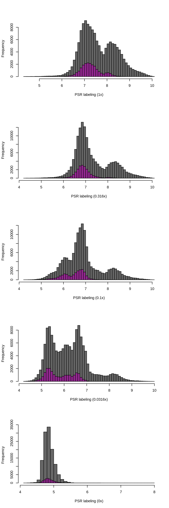
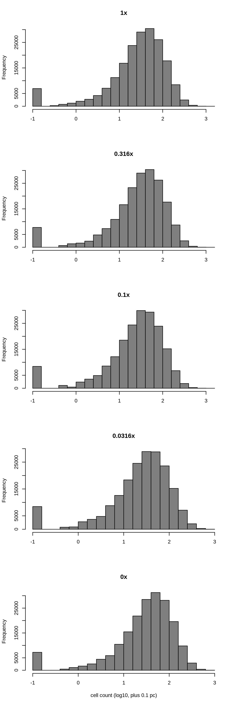
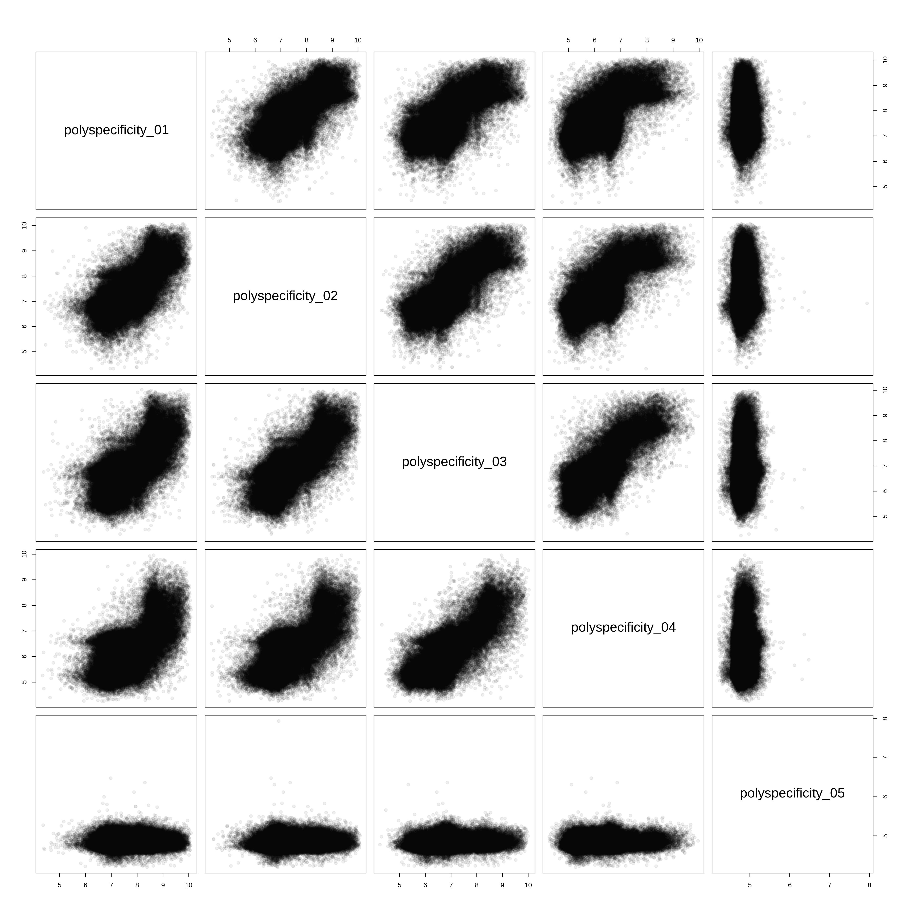
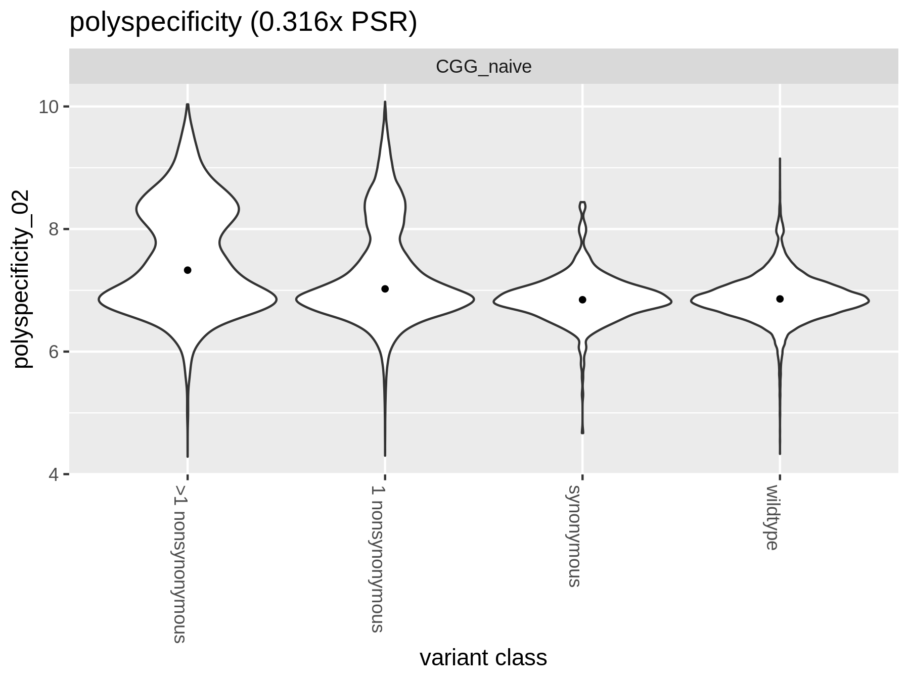

Compute per-barcode polyspecificity reactivity
================
Tyler Starr
8/9/2021

This notebook reads in per-barcode counts from `count_variants.ipynb`
for PSR-binding mini-Tite-seq experiments, computes functional scores
for binding of each barcoded variant to the PSR reagent, and does some
basic QC on variant binding functional scores.

``` r
require("knitr")
knitr::opts_chunk$set(echo = T)
knitr::opts_chunk$set(dev.args = list(png = list(type = "cairo")))

#list of packages to install/load
packages = c("yaml","data.table","tidyverse","gridExtra","fitdistrplus")
#install any packages not already installed
installed_packages <- packages %in% rownames(installed.packages())
if(any(installed_packages == F)){
  install.packages(packages[!installed_packages])
}
#load packages
invisible(lapply(packages, library, character.only=T))

#read in config file
config <- read_yaml("config.yaml")

#make output directory
if(!file.exists(config$PSR_bind_dir)){
  dir.create(file.path(config$PSR_bind_dir))
}
```

Session info for reproducing environment:

``` r
sessionInfo()
```

    ## R version 3.6.2 (2019-12-12)
    ## Platform: x86_64-pc-linux-gnu (64-bit)
    ## Running under: Ubuntu 18.04.5 LTS
    ## 
    ## Matrix products: default
    ## BLAS/LAPACK: /app/software/OpenBLAS/0.3.7-GCC-8.3.0/lib/libopenblas_haswellp-r0.3.7.so
    ## 
    ## locale:
    ##  [1] LC_CTYPE=en_US.UTF-8       LC_NUMERIC=C              
    ##  [3] LC_TIME=en_US.UTF-8        LC_COLLATE=en_US.UTF-8    
    ##  [5] LC_MONETARY=en_US.UTF-8    LC_MESSAGES=en_US.UTF-8   
    ##  [7] LC_PAPER=en_US.UTF-8       LC_NAME=C                 
    ##  [9] LC_ADDRESS=C               LC_TELEPHONE=C            
    ## [11] LC_MEASUREMENT=en_US.UTF-8 LC_IDENTIFICATION=C       
    ## 
    ## attached base packages:
    ## [1] stats     graphics  grDevices utils     datasets  methods   base     
    ## 
    ## other attached packages:
    ##  [1] fitdistrplus_1.0-14 npsurv_0.4-0        lsei_1.2-0         
    ##  [4] survival_3.1-8      MASS_7.3-51.4       gridExtra_2.3      
    ##  [7] forcats_0.4.0       stringr_1.4.0       dplyr_0.8.3        
    ## [10] purrr_0.3.3         readr_1.3.1         tidyr_1.0.0        
    ## [13] tibble_3.0.2        ggplot2_3.3.0       tidyverse_1.3.0    
    ## [16] data.table_1.12.8   yaml_2.2.0          knitr_1.26         
    ## 
    ## loaded via a namespace (and not attached):
    ##  [1] tidyselect_1.1.0 xfun_0.11        lattice_0.20-38  splines_3.6.2   
    ##  [5] haven_2.2.0      colorspace_1.4-1 vctrs_0.3.1      generics_0.0.2  
    ##  [9] htmltools_0.4.0  rlang_0.4.7      pillar_1.4.5     glue_1.3.1      
    ## [13] withr_2.1.2      DBI_1.1.0        dbplyr_1.4.2     modelr_0.1.5    
    ## [17] readxl_1.3.1     lifecycle_0.2.0  munsell_0.5.0    gtable_0.3.0    
    ## [21] cellranger_1.1.0 rvest_0.3.5      evaluate_0.14    fansi_0.4.0     
    ## [25] broom_0.7.0      Rcpp_1.0.3       scales_1.1.0     backports_1.1.5 
    ## [29] jsonlite_1.6     fs_1.3.1         hms_0.5.2        digest_0.6.23   
    ## [33] stringi_1.4.3    grid_3.6.2       cli_2.0.0        tools_3.6.2     
    ## [37] magrittr_1.5     crayon_1.3.4     pkgconfig_2.0.3  Matrix_1.2-18   
    ## [41] ellipsis_0.3.0   xml2_1.2.2       reprex_0.3.0     lubridate_1.7.4 
    ## [45] assertthat_0.2.1 rmarkdown_2.0    httr_1.4.1       rstudioapi_0.10 
    ## [49] R6_2.4.1         compiler_3.6.2

## Setup

First, we will read in metadata on our sort samples, the table giving
number of reads of each barcode in each of the sort bins, and the
barcode-variant lookup tables, and merge these tables together.

``` r
#read dataframe with list of barcode runs
barcode_runs <- read.csv(file=config$barcode_runs,stringsAsFactors=F); barcode_runs <- subset(barcode_runs, select=-c(R1))

#eliminate rows from barcode_runs that are not from a PSR binding experiment
barcode_runs <- barcode_runs[barcode_runs$sample_type == "PSR",]

#read file giving count of each barcode in each sort partition
counts <- data.table(read.csv(file=config$variant_counts_file,stringsAsFactors=F))

#eliminate rows from counts that are not part of an titration bin sample
counts <- subset(counts, sample %in% barcode_runs[barcode_runs$sample_type=="PSR","sample"])

#read in barcode-variant lookup tables
dt <- data.table(read.csv(file=config$codon_variant_table_file,stringsAsFactors=F))

dt <- merge(counts, dt, by=c("library","barcode")) ;rm(counts)
```

Convert from Illumina read counts to estimates of the number of cells
that were sorted into a bin, and add some other useful information to
our data frame.

``` r
#for each bin, normalize the read counts to the observed ratio of cell recovery among bins
for(i in 1:nrow(barcode_runs)){
  lib <- as.character(barcode_runs$library[i])
  bin <- as.character(barcode_runs$sample[i])
  ratio <- sum(dt[library==lib & sample==bin,"count"])/barcode_runs$number_cells[i]
  if(ratio<1){ #if there are fewer reads from a FACS bin than cells sorted
    dt[library==lib & sample==bin, count.norm := as.numeric(count)] #don't normalize cell counts, make count.norm the same as count
    print(paste("reads < cells for",lib,bin,", un-normalized (ratio",ratio,")")) #print to console to inform of undersampled bins
  }else{
    dt[library==lib & sample==bin, count.norm := as.numeric(count/ratio)] #normalize read counts by the average read:cell ratio, report in new "count.norm" column
    print(paste("read:cell ratio for",lib,bin,"is",ratio))
  }
}
```

    ## [1] "read:cell ratio for lib1 PSR_01_bin1 is 1.57243383447812"
    ## [1] "read:cell ratio for lib1 PSR_01_bin2 is 2.32407956705449"
    ## [1] "read:cell ratio for lib1 PSR_01_bin3 is 3.37123210237748"
    ## [1] "read:cell ratio for lib1 PSR_01_bin4 is 2.72613275657003"
    ## [1] "reads < cells for lib1 PSR_02_bin1 , un-normalized (ratio 0.940529459739458 )"
    ## [1] "read:cell ratio for lib1 PSR_02_bin2 is 2.28305598361071"
    ## [1] "read:cell ratio for lib1 PSR_02_bin3 is 2.43843184320322"
    ## [1] "read:cell ratio for lib1 PSR_02_bin4 is 2.81314184753935"
    ## [1] "read:cell ratio for lib1 PSR_03_bin1 is 1.45030816520287"
    ## [1] "read:cell ratio for lib1 PSR_03_bin2 is 3.31879633215544"
    ## [1] "read:cell ratio for lib1 PSR_03_bin3 is 2.85277036272405"
    ## [1] "read:cell ratio for lib1 PSR_03_bin4 is 2.38708195264742"
    ## [1] "read:cell ratio for lib1 PSR_04_bin1 is 2.96465768136888"
    ## [1] "read:cell ratio for lib1 PSR_04_bin2 is 2.98846249088557"
    ## [1] "read:cell ratio for lib1 PSR_04_bin3 is 2.91401908258126"
    ## [1] "read:cell ratio for lib1 PSR_04_bin4 is 1.7215320038435"
    ## [1] "read:cell ratio for lib1 PSR_05_bin1 is 1.85102450512718"
    ## [1] "read:cell ratio for lib1 PSR_05_bin2 is 1.05934297037091"
    ## [1] "read:cell ratio for lib1 PSR_05_bin3 is 63.6852846401719"
    ## [1] "read:cell ratio for lib1 PSR_05_bin4 is 3.56976744186047"
    ## [1] "reads < cells for lib2 PSR_01_bin1 , un-normalized (ratio 0.692336859298437 )"
    ## [1] "read:cell ratio for lib2 PSR_01_bin2 is 1.71868189728174"
    ## [1] "read:cell ratio for lib2 PSR_01_bin3 is 3.03222347795569"
    ## [1] "read:cell ratio for lib2 PSR_01_bin4 is 3.01919223471977"
    ## [1] "read:cell ratio for lib2 PSR_02_bin1 is 1.33665288942407"
    ## [1] "read:cell ratio for lib2 PSR_02_bin2 is 1.98367055773351"
    ## [1] "read:cell ratio for lib2 PSR_02_bin3 is 1.61105753630358"
    ## [1] "read:cell ratio for lib2 PSR_02_bin4 is 1.6573819701649"
    ## [1] "reads < cells for lib2 PSR_03_bin1 , un-normalized (ratio 0.51233946464694 )"
    ## [1] "reads < cells for lib2 PSR_03_bin2 , un-normalized (ratio 0.532098574465292 )"
    ## [1] "read:cell ratio for lib2 PSR_03_bin3 is 1.98201112501093"
    ## [1] "reads < cells for lib2 PSR_03_bin4 , un-normalized (ratio 0.925218885773819 )"
    ## [1] "reads < cells for lib2 PSR_04_bin1 , un-normalized (ratio 0.918073316609049 )"
    ## [1] "reads < cells for lib2 PSR_04_bin2 , un-normalized (ratio 0.720167360293554 )"
    ## [1] "read:cell ratio for lib2 PSR_04_bin3 is 2.9446942880954"
    ## [1] "read:cell ratio for lib2 PSR_04_bin4 is 2.97597233221684"
    ## [1] "read:cell ratio for lib2 PSR_05_bin1 is 2.87730585306538"
    ## [1] "read:cell ratio for lib2 PSR_05_bin2 is 2.51438700383372"
    ## [1] "read:cell ratio for lib2 PSR_05_bin3 is 6.418410041841"
    ## [1] "reads < cells for lib2 PSR_05_bin4 , un-normalized (ratio 0.560975609756098 )"

``` r
#annotate each barcode as to whether it's a homolog variant, SARS-CoV-2 wildtype, synonymous muts only, stop, nonsynonymous, >1 nonsynonymous mutations
dt[,variant_class:=as.character(NA)]
dt[n_codon_substitutions==0, variant_class := "wildtype"]
dt[n_codon_substitutions > 0 & n_aa_substitutions==0, variant_class := "synonymous"]
dt[n_aa_substitutions>0 & grepl("*",aa_substitutions,fixed=T), variant_class := "stop"]
dt[n_aa_substitutions == 1 & !grepl("*",aa_substitutions,fixed=T), variant_class := "1 nonsynonymous"]
dt[n_aa_substitutions > 1 & !grepl("*",aa_substitutions,fixed=T), variant_class := ">1 nonsynonymous"]

#cast the data frame into wide format
dt <- dcast(dt, library + barcode + target + variant_class + aa_substitutions + n_aa_substitutions ~ sample, value.var="count.norm")
```

## Calculating mean bin for each barcode at each sample concentration

Next, for each barcode at each of the PSR concentrations, calculate the
“mean bin” response variable. We will use a maximum likelihood approach
to determine the mean and standard deviation of fluorescence for a
barcode, given its distribution of cell counts across sort bins, and the
known fluorescence boundaries of those sort bins from the sorting log.
The package `fitdistcens` enables this ML estimation for these type of
*censored* observations, where we know we observed a cell within some
fluorescence interval but do not know the exact fluorescence value
attributed to that observation. The counts are multiplied by 20 so that
there is not a large rounding effect when they are rounded to integers.

Fluorescence boundaries of the sort bins

    (-288, 183), (184, 892), (893, 3892), (3893, 262143)

``` r
#add total count corresponding to count across the four bins for each barcode. 
dt[,psr_count_01 := sum(PSR_01_bin1,PSR_01_bin2,PSR_01_bin3,PSR_01_bin4),by=c("library","barcode")]
#add indicator if count>1 in >1 bin
dt[,total_bins_w_count_01 := sum(.(PSR_01_bin1,PSR_01_bin2,PSR_01_bin3,PSR_01_bin4)>0),by=c("library","barcode")]

#add total count corresponding to count across the four bins for each barcode. 
dt[,psr_count_02 := sum(PSR_02_bin1,PSR_02_bin2,PSR_02_bin3,PSR_02_bin4),by=c("library","barcode")]
#add indicator if count>1 in >1 bin
dt[,total_bins_w_count_02 := sum(.(PSR_02_bin1,PSR_02_bin2,PSR_02_bin3,PSR_02_bin4)>0),by=c("library","barcode")]

#add total count corresponding to count across the four bins for each barcode. 
dt[,psr_count_03 := sum(PSR_03_bin1,PSR_03_bin2,PSR_03_bin3,PSR_03_bin4),by=c("library","barcode")]
#add indicator if count>1 in >1 bin
dt[,total_bins_w_count_03 := sum(.(PSR_03_bin1,PSR_03_bin2,PSR_03_bin3,PSR_03_bin4)>0),by=c("library","barcode")]

#add total count corresponding to count across the four bins for each barcode. 
dt[,psr_count_04 := sum(PSR_04_bin1,PSR_04_bin2,PSR_04_bin3,PSR_04_bin4),by=c("library","barcode")]
#add indicator if count>1 in >1 bin
dt[,total_bins_w_count_04 := sum(.(PSR_04_bin1,PSR_04_bin2,PSR_04_bin3,PSR_04_bin4)>0),by=c("library","barcode")]

#add total count corresponding to count across the four bins for each barcode. 
dt[,psr_count_05 := sum(PSR_05_bin1,PSR_05_bin2,PSR_05_bin3,PSR_05_bin4),by=c("library","barcode")]
#add indicator if count>1 in >1 bin
dt[,total_bins_w_count_05 := sum(.(PSR_05_bin1,PSR_05_bin2,PSR_05_bin3,PSR_05_bin4)>0),by=c("library","barcode")]


#define function to calculate ML meanF
calc.MLmean <- function(b1,b2,b3,b4,min.b1,min.b2,min.b3,min.b4,max.b4,min.count=1){ #b1-4 gives observed cell counts in bins 1-4; remaining arguments give fluorescence boundaries of the respective bins; min.count gives minimum number of total observations needed across bins in order to calculate meanF (default 1)
  data <- data.frame(left=c(rep(min.b1,round(b1)),rep(min.b2,round(b2)),rep(min.b3,round(b3)),rep(min.b4,round(b4))),
                     right=c(rep(min.b2,round(b1)),rep(min.b3,round(b2)),rep(min.b4,round(b3)),rep(max.b4,round(b4)))) #define data input in format required for fitdistcens
  if(nrow(unique(data))>1 & nrow(data)>min.count){ #only fits if above user-specified min.count, and if the data satisfies the fitdistcens requirement that cells are observed in at least two of the censored partitions to enable ML estimation of identifiable parameters
    fit <- fitdistcens(data,"norm")
    return(list(as.numeric(summary(fit)$estimate["mean"]),as.numeric(summary(fit)$estimate["sd"])))
  } else {
    return(list(as.numeric(NA),as.numeric(NA)))
  }
}

#fit ML mean and sd fluorescence for each barcode, and calculate total cell count as the sum across the four bins. Multiply cell counts by a factor of 20 to minimize rounding errors since fitdistcens requires rounding to integer inputs
invisible(dt[,c("polyspecificity_01","PSR_sdF_01") := tryCatch(calc.MLmean(b1=PSR_01_bin1*20,b2=PSR_01_bin2*20,
                                                                      b3=PSR_01_bin3*20,b4=PSR_01_bin4*20,
                                                                      min.b1=log(20),min.b2=log(183.5),min.b3=log(892.5),
                                                                      min.b4=log(3892),max.b4=log(229000)),
                                                          error=function(e){return(list(as.numeric(NA),as.numeric(NA)))}),by=c("library","barcode")])

invisible(dt[,c("polyspecificity_02","PSR_sdF_02") := tryCatch(calc.MLmean(b1=PSR_02_bin1*20,b2=PSR_02_bin2*20,
                                                                      b3=PSR_02_bin3*20,b4=PSR_02_bin4*20,
                                                                      min.b1=log(20),min.b2=log(183.5),min.b3=log(892.5),
                                                                      min.b4=log(3892),max.b4=log(229000)),
                                                          error=function(e){return(list(as.numeric(NA),as.numeric(NA)))}),by=c("library","barcode")])

invisible(dt[,c("polyspecificity_03","PSR_sdF_03") := tryCatch(calc.MLmean(b1=PSR_03_bin1*20,b2=PSR_03_bin2*20,
                                                                      b3=PSR_03_bin3*20,b4=PSR_03_bin4*20,
                                                                      min.b1=log(20),min.b2=log(183.5),min.b3=log(892.5),
                                                                      min.b4=log(3892),max.b4=log(229000)),
                                                          error=function(e){return(list(as.numeric(NA),as.numeric(NA)))}),by=c("library","barcode")])

invisible(dt[,c("polyspecificity_04","PSR_sdF_04") := tryCatch(calc.MLmean(b1=PSR_04_bin1*20,b2=PSR_04_bin2*20,
                                                                      b3=PSR_04_bin3*20,b4=PSR_04_bin4*20,
                                                                      min.b1=log(20),min.b2=log(183.5),min.b3=log(892.5),
                                                                      min.b4=log(3892),max.b4=log(229000)),
                                                          error=function(e){return(list(as.numeric(NA),as.numeric(NA)))}),by=c("library","barcode")])

invisible(dt[,c("polyspecificity_05","PSR_sdF_05") := tryCatch(calc.MLmean(b1=PSR_05_bin1*20,b2=PSR_05_bin2*20,
                                                                      b3=PSR_05_bin3*20,b4=PSR_05_bin4*20,
                                                                      min.b1=log(20),min.b2=log(183.5),min.b3=log(892.5),
                                                                      min.b4=log(3892),max.b4=log(229000)),
                                                          error=function(e){return(list(as.numeric(NA),as.numeric(NA)))}),by=c("library","barcode")])


#save temp data file for downstream troubleshooting since the ML meanF took >1hr to calculate -- don't use these for final anlaysis though for reproducibility!
save(dt,file=paste(config$PSR_bind_dir,"/dt.temp.Rda",sep=""))
#load(file=paste(config$PSR_bind_dir,"/dt.temp.Rda",sep=""))
```

## Basic plotting and QC

Some stop variants eked through our scFv+ selection gate, remove the
remaining.

``` r
dt[variant_class == "stop",c("polyspecificity_01","polyspecificity_02","polyspecificity_03","polyspecificity_04","polyspecificity_05") := list(as.numeric(NA),as.numeric(NA),as.numeric(NA),as.numeric(NA),as.numeric(NA))]

dt[variant_class == "stop",c("psr_count_01","psr_count_02","psr_count_03","psr_count_04","psr_count_05") := list(as.numeric(NA),as.numeric(NA),as.numeric(NA),as.numeric(NA),as.numeric(NA))]
```

Let’s look at the distibution of expression scores by variant class for
each library.

``` r
par(mfrow=c(5,1))
#histogram of mean psr bin, separated by class
hist(dt[variant_class %in% (c("1 nonsynonymous",">1 nonsynonymous")),polyspecificity_01],col="gray40",main="",breaks=50,xlab="PSR labeling (1x)")
hist(dt[variant_class %in% (c("synonymous","wildtype")),polyspecificity_01],col="#92278F",add=T,breaks=50)

hist(dt[variant_class %in% (c("1 nonsynonymous",">1 nonsynonymous")),polyspecificity_02],col="gray40",main="",breaks=50,xlab="PSR labeling (0.316x)")
hist(dt[variant_class %in% (c("synonymous","wildtype")),polyspecificity_02],col="#92278F",add=T,breaks=50)

hist(dt[variant_class %in% (c("1 nonsynonymous",">1 nonsynonymous")),polyspecificity_03],col="gray40",main="",breaks=50,xlab="PSR labeling (0.1x)")
hist(dt[variant_class %in% (c("synonymous","wildtype")),polyspecificity_03],col="#92278F",add=T,breaks=50)

hist(dt[variant_class %in% (c("1 nonsynonymous",">1 nonsynonymous")),polyspecificity_04],col="gray40",main="",breaks=50,xlab="PSR labeling (0.0316x)")
hist(dt[variant_class %in% (c("synonymous","wildtype")),polyspecificity_04],col="#92278F",add=T,breaks=50)

hist(dt[variant_class %in% (c("1 nonsynonymous",">1 nonsynonymous")),polyspecificity_05],col="gray40",main="",breaks=50,xlab="PSR labeling (0x)")
hist(dt[variant_class %in% (c("synonymous","wildtype")),polyspecificity_05],col="#92278F",add=T,breaks=50)
```



Next let’s look at the distributon of cell counts across the four bins
for each barcode.

``` r
#histograms
par(mfrow=c(5,1))
hist(log10(dt[,psr_count_01]+0.1),xlab="",main="1x",col="gray50")
hist(log10(dt[,psr_count_02]+0.1),xlab="",main="0.316x",col="gray50")
hist(log10(dt[,psr_count_03]+0.1),xlab="",main="0.1x",col="gray50")
hist(log10(dt[,psr_count_04]+0.1),xlab="",main="0.0316x",col="gray50")
hist(log10(dt[,psr_count_05]+0.1),xlab="cell count (log10, plus 0.1 pc)",main="0x",col="gray50")
```


Filter out expression measurements determined from \<10 estimated cells

``` r
min_count <- 10
dt[psr_count_01<min_count, c("polyspecificity_01","psr_count_01") := NA]
dt[psr_count_02<min_count, c("polyspecificity_02","psr_count_02") := NA]
dt[psr_count_03<min_count, c("polyspecificity_03","psr_count_03") := NA]
dt[psr_count_04<min_count, c("polyspecificity_04","psr_count_04") := NA]
dt[psr_count_05<min_count, c("polyspecificity_05","psr_count_05") := NA]
```

Look at correlations in PSR labeling for each of the five concentrations
of PSR reagent.

``` r
pairs(dt[,.(polyspecificity_01,polyspecificity_02,polyspecificity_03,polyspecificity_04,polyspecificity_05)], main="",pch=19,col="#00000010")
```



``` r
invisible(dev.print(pdf, paste(config$PSR_bind_dir,"/correlations_PSR_concentrations.pdf",sep=""),useDingbats=F))
```

Look at PSR 02 as violin plots, faceted by each target. In next
notebook, we’ll evaluate count depth and possibly apply further
filtering to remove low-count expression estimates

``` r
p1 <- ggplot(dt[!is.na(polyspecificity_02),],aes(x=variant_class,y=polyspecificity_02))+
  geom_violin(scale="width")+stat_summary(fun=median,geom="point",size=1)+
  ggtitle("polyspecificity (0.316x PSR)")+xlab("variant class")+theme(axis.text.x=element_text(angle=-90,hjust=0))+
  facet_wrap(~target,nrow=4)

grid.arrange(p1,ncol=1)
```



``` r
#save pdf
invisible(dev.print(pdf, paste(config$PSR_bind_dir,"/violin-plot_PSR-by-target.pdf",sep="")))
```

We have generated PSR binding measurements for 78.15% of the barcodes in
our libraries. (0.316x PSR)

## Data Output

Finally, let’s output our measurements for downstream analyses.

``` r
dt[,.(library,barcode,target,variant_class,aa_substitutions,n_aa_substitutions,
     psr_count_01,polyspecificity_01,
     psr_count_02,polyspecificity_02,
     psr_count_03,polyspecificity_03,
     psr_count_04,polyspecificity_04,
     psr_count_05,polyspecificity_05)] %>%
  mutate_if(is.numeric, round, digits=6) %>%
  write.csv(file=config$PSR_bind_file, row.names=F)
```
