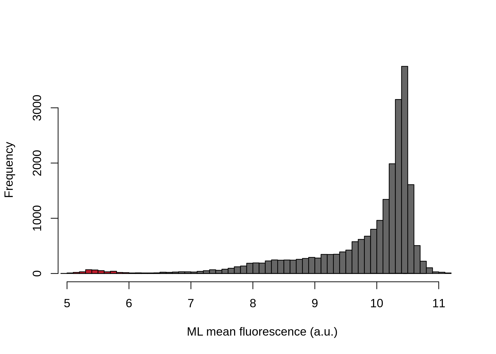
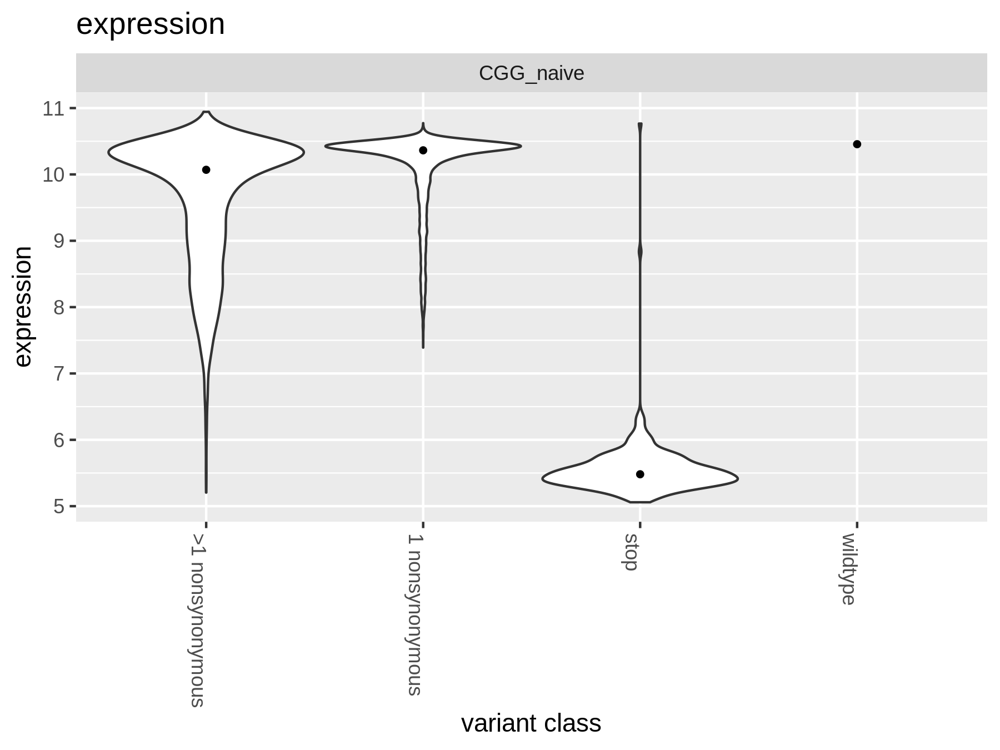

Compute per-variant expression functional score
================
Tyler Starr
8/6/2021

This notebook reads in per-barcode counts from `count_variants.ipynb`
for expression Sort-seq experiments, computes functional scores for scFv
expression levels, and does some basic QC on variant expression
functional scores.

``` r
require("knitr")
knitr::opts_chunk$set(echo = T)
knitr::opts_chunk$set(dev.args = list(png = list(type = "cairo")))
options(repos = c(CRAN = "https://cran.r-project.org"))

#list of packages to install/load
packages = c("yaml","data.table","tidyverse","fitdistrplus","gridExtra")
#install any packages not already installed
installed_packages <- packages %in% rownames(installed.packages())
if(any(installed_packages == F)){
  install.packages(packages[!installed_packages])
}
#load packages
invisible(lapply(packages, library, character.only=T))

#read in config file
config <- read_yaml("config.yaml")

#make output directory
if(!file.exists(config$expression_sortseq_dir)){
  dir.create(file.path(config$expression_sortseq_dir))
}
```

Session info for reproducing environment:

``` r
sessionInfo()
```

    ## R version 3.6.3 (2020-02-29)
    ## Platform: x86_64-conda-linux-gnu (64-bit)
    ## Running under: Ubuntu 18.04.6 LTS
    ## 
    ## Matrix products: default
    ## BLAS/LAPACK: /fh/fast/matsen_e/jgallowa/Ab-CGGnaive_DMS/.snakemake/conda/14854db9156898a213246f7d6480a8f3_/lib/libopenblasp-r0.3.28.so
    ## 
    ## locale:
    ##  [1] LC_CTYPE=en_US.UTF-8       LC_NUMERIC=C              
    ##  [3] LC_TIME=en_US.UTF-8        LC_COLLATE=en_US.UTF-8    
    ##  [5] LC_MONETARY=en_US.UTF-8    LC_MESSAGES=en_US.UTF-8   
    ##  [7] LC_PAPER=en_US.UTF-8       LC_NAME=C                 
    ##  [9] LC_ADDRESS=C               LC_TELEPHONE=C            
    ## [11] LC_MEASUREMENT=en_US.UTF-8 LC_IDENTIFICATION=C       
    ## 
    ## attached base packages:
    ## [1] stats     graphics  grDevices utils     datasets  methods   base     
    ## 
    ## other attached packages:
    ##  [1] gridExtra_2.3      fitdistrplus_1.1-3 survival_3.2-11    MASS_7.3-54       
    ##  [5] forcats_0.5.1      stringr_1.4.0      dplyr_1.0.6        purrr_0.3.4       
    ##  [9] readr_1.4.0        tidyr_1.1.3        tibble_3.1.2       ggplot2_3.3.3     
    ## [13] tidyverse_1.3.1    data.table_1.14.0  yaml_2.2.1         knitr_1.33        
    ## 
    ## loaded via a namespace (and not attached):
    ##  [1] tidyselect_1.1.1  xfun_0.23         lattice_0.20-44   splines_3.6.3    
    ##  [5] haven_2.4.1       colorspace_2.0-1  vctrs_0.3.8       generics_0.1.0   
    ##  [9] htmltools_0.5.1.1 utf8_1.2.1        rlang_0.4.11      pillar_1.6.1     
    ## [13] glue_1.4.2        withr_3.0.2       DBI_1.1.1         dbplyr_2.1.1     
    ## [17] modelr_0.1.8      readxl_1.3.1      lifecycle_1.0.0   munsell_0.5.0    
    ## [21] gtable_0.3.0      cellranger_1.1.0  rvest_1.0.0       evaluate_0.14    
    ## [25] ps_1.6.0          fansi_0.4.2       broom_0.7.6       Rcpp_1.0.13-1    
    ## [29] scales_1.1.1      backports_1.2.1   jsonlite_1.7.2    fs_1.5.0         
    ## [33] hms_1.1.0         digest_0.6.27     stringi_1.6.2     grid_3.6.3       
    ## [37] cli_2.5.0         tools_3.6.3       magrittr_2.0.1    crayon_1.4.1     
    ## [41] pkgconfig_2.0.3   Matrix_1.3-3      ellipsis_0.3.2    xml2_1.3.2       
    ## [45] reprex_2.0.0      lubridate_1.7.10  assertthat_0.2.1  rmarkdown_2.8    
    ## [49] httr_1.4.2        rstudioapi_0.13   R6_2.5.0          compiler_3.6.3

## Setup

``` r
pdt <- data.table(read.csv(file=config$prepped_variant_counts_file,stringsAsFactors=F))
# retain all rows where 'SortSeq' is in the 'sample' string
pdt <- pdt[grepl("SortSeq", sample)]
# rename columns: 
# read_count -> count, 
# estimated_cell_count -> count.norm, 
# variants -> aa_substitutions, 
# barcode -> variant_call_support, 
# bin -> sample
setnames(
  pdt, 
  c("read_count", "estimated_cell_count", "variant", "barcode"), 
  c("count", "count.norm", "aa_substitutions", "n_bc_expr")
)
# assign a column "target" with all values equal to "CGG_naive"
pdt[, target := "CGG_naive"]

pdt[,variant_class:=as.character(NA)]
pdt[n_aa_substitutions==0, variant_class := "wildtype"]
# note that we've dropped all synonymous variants with silent mutations in the prep stage.
pdt[n_aa_substitutions>0 & grepl("*",aa_substitutions,fixed=T), variant_class := "stop"]
pdt[n_aa_substitutions == 1 & !grepl("*",aa_substitutions,fixed=T), variant_class := "1 nonsynonymous"]
pdt[n_aa_substitutions > 1 & !grepl("*",aa_substitutions,fixed=T), variant_class := ">1 nonsynonymous"]
```

``` r
#cast the data frame into wide format
pdt <- dcast(pdt, library + target + variant_class + aa_substitutions + n_aa_substitutions + n_bc_expr ~ sample, value.var="count.norm")
```

``` r
#add total count corresponding to count across the four bins for each barcode
pdt[,expr_count := sum(SortSeq_bin1,SortSeq_bin2,SortSeq_bin3,SortSeq_bin4),by=c("library","aa_substitutions")]

#add indicator if count>1 in >1 bin
pdt[,total_bins_w_count := sum(.(SortSeq_bin1,SortSeq_bin2,SortSeq_bin3,SortSeq_bin4)>0),by=c("library","aa_substitutions")]
```

## Calculating mean fluorescence

Next, for each barcode, calculate its mean fluorescence as an indicator
of RBD expression level. We will use a maximum likelihood approach to
determine the mean and standard deviation of fluorescence for a barcode,
given its distribution of cell counts across sort bins, and the known
fluorescence boundaries of those sort bins from the sorting log. The
package `fitdistcens` enables this ML estimation for these type of
*censored* observations, where we know we observed a cell within some
fluorescence interval but do not know the exact fluorescence value
attributed to that observation. The counts are multiplied by 20 so that
there is not a large rounding effect when they are rounded to integers.

``` r
#define function to calculate ML meanF
calc.MLmean <- function(b1,b2,b3,b4,min.b1,min.b2,min.b3,min.b4,max.b4,min.count=1){ #b1-4 gives observed cell counts in bins 1-4; remaining arguments give fluorescence boundaries of the respective bins; min.count gives minimum number of total observations needed across bins in order to calculate meanF (default 1)
  data <- data.frame(left=c(rep(min.b1,round(b1)),rep(min.b2,round(b2)),rep(min.b3,round(b3)),rep(min.b4,round(b4))),
                     right=c(rep(min.b2,round(b1)),rep(min.b3,round(b2)),rep(min.b4,round(b3)),rep(max.b4,round(b4)))) #define data input in format required for fitdistcens
  if(nrow(unique(data))>1 & nrow(data)>min.count){ #only fits if above user-specified min.count, and if the data satisfies the fitdistcens requirement that cells are observed in at least two of the censored partitions to enable ML estimation of identifiable parameters
    fit <- fitdistcens(data,"norm")
    return(list(as.numeric(summary(fit)$estimate["mean"]),as.numeric(summary(fit)$estimate["sd"])))
  } else {
    return(list(as.numeric(NA),as.numeric(NA)))
  }
}

#fit ML mean and sd fluorescence for each barcode, and calculate total cell count as the sum across the four bins. Multiply cell counts by a factor of 20 to minimize rounding errors since fitdistcens requires rounding to integer inputs
invisible(pdt[library=="lib1",c("expression","ML_sdF") := tryCatch(calc.MLmean(b1=SortSeq_bin1*20,b2=SortSeq_bin2*20,
                                                                      b3=SortSeq_bin3*20,b4=SortSeq_bin4*20,
                                                                      min.b1=log(20),min.b2=log(645.5),min.b3=log(15584.5),
                                                                      min.b4=log(33302.5),max.b4=log(229000)),
                                                          error=function(e){return(list(as.numeric(NA),as.numeric(NA)))}),by=c("library","aa_substitutions")])
invisible(pdt[library=="lib2",c("expression","ML_sdF") := tryCatch(calc.MLmean(b1=SortSeq_bin1*20,b2=SortSeq_bin2*20,
                                                                      b3=SortSeq_bin3*20,b4=SortSeq_bin4*20,
                                                                      min.b1=log(20),min.b2=log(645.5),min.b3=log(15584.5),
                                                                      min.b4=log(33302.5),max.b4=log(229000)),
                                                          error=function(e){return(list(as.numeric(NA),as.numeric(NA)))}),by=c("library","aa_substitutions")])

#save temp data file for downstream troubleshooting since the ML meanF took >1hr to calculate -- don't use these for final anlaysis though for reproducibility!
save(pdt,file=paste(config$expression_sortseq_dir,"/dt.temp.Rda",sep=""))
```

## Basic plotting and QC

Let’s look at the distibution of expression scores by variant class for
each library.

``` r
#histogram of mean F, separated by class
hist(pdt[variant_class %in% (c("1 nonsynonymous",">1 nonsynonymous")),expression],col="gray40",main="",breaks=50,xlab="ML mean fluorescence (a.u.)")
hist(pdt[variant_class %in% (c("wildtype")),expression],col="#92278F",add=T,breaks=50)
hist(pdt[variant_class %in% (c("stop")),expression],col="#BE1E2D",add=T,breaks=50)
```



Next let’s look at the distributon of cell counts across the four bins
for each barcode, for those for which estimates were generated on the
bottom.

``` r
#histograms
par(mfrow=c(2,2))
hist(log10(pdt[library=="lib1",expr_count]+0.1),xlab="cell count (log10, plus 0.1 pseudocount)",main="lib1, all bc",col="gray50")
hist(log10(pdt[library=="lib2",expr_count]+0.1),xlab="cell count (log10, plus 0.1 pseudocount)",main="lib2, all bc",col="gray50")
hist(log10(pdt[library=="lib1" & !is.na(expression),expr_count]+0.1),xlab="cell count (log10, plus 0.1 pseudocount)",main="lib1, determined",col="gray50")
hist(log10(pdt[library=="lib2" & !is.na(expression),expr_count]+0.1),xlab="cell count (log10, plus 0.1 pseudocount)",main="lib2, determined",col="gray50")
```


Filter out expression measurements determined from \<10 estimated cells

``` r
min_count <- config$min_Sortseq_reads_per_variant
pdt[expr_count<min_count, c("expression","ML_sdF","expr_count") := NA]
```

Do as violin plots, faceted by each target. In next notebook, we’ll
evaluate count depth and possibly apply further filtering to remove
low-count expression estimates

``` r
p1 <- ggplot(pdt[!is.na(expression),],aes(x=variant_class,y=expression))+
  geom_violin(scale="width")+stat_summary(fun=median,geom="point",size=1)+
  ggtitle("expression")+xlab("variant class")+theme(axis.text.x=element_text(angle=-90,hjust=0))+
  facet_wrap(~target,nrow=4)

grid.arrange(p1,ncol=1)
```



``` r
#save pdf
invisible(dev.print(pdf, paste(config$expression_sortseq_dir,"/violin-plot_meanF-by-target.pdf",sep="")))
```

We have generated expression measurements for 57.87% of the barcodes in
our libraries.

## Data Output

Finally, let’s output our measurements for downstream analyses.

``` r
pdt[,.(library,target,variant_class,aa_substitutions,n_aa_substitutions,n_bc_expr,
     expr_count,expression)] %>%
  mutate_if(is.numeric, round, digits=6) %>%
  write.csv(file=config$expression_sortseq_file, row.names=F)
```
