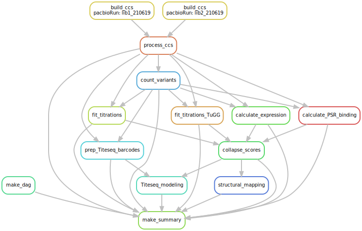

# Summary

Analysis run by [Snakefile](../../Snakefile)
using [this config file](../../config.yaml).
See the [README in the top directory](../../README.md)
for details.

Here is the DAG of the computational workflow:

Here is the Markdown output of each Jupyter notebook in the
workflow:

1. [Process PacBio CCSs](process_ccs.md). Creates a [barcode-variant lookup table](../variants/codon_variant_table.csv).

2. [Count variants by barcode](count_variants.md).
   Creates a [variant counts file](../counts/variant_counts.csv)
   giving counts of each barcoded variant in each condition.

3. [Fit CGG-binding titration curves](compute_binding_Kd.md) to calculate per-barcode KD, recorded in [this file](../binding_Kd/bc_binding.csv).

4. [Fit polyspecificity reagent binding Sort-seq](compute_binding_PSR.md) to calculate per-barcode polyspecificity score, recorded in [this file](../PSR_bind/bc_polyspecificity.csv).

5. [Analyze Sort-seq](compute_expression_meanF.md) to calculate per-barcode RBD expression, recorded in [this file](../expression_meanF/bc_expression.csv).

6. [Derive final genotype-level phenotypes from replicate barcoded sequences](collapse_scores.md).
   Generates final phenotypes, recorded in [this file](../final_variant_scores/final_variant_scores.csv).