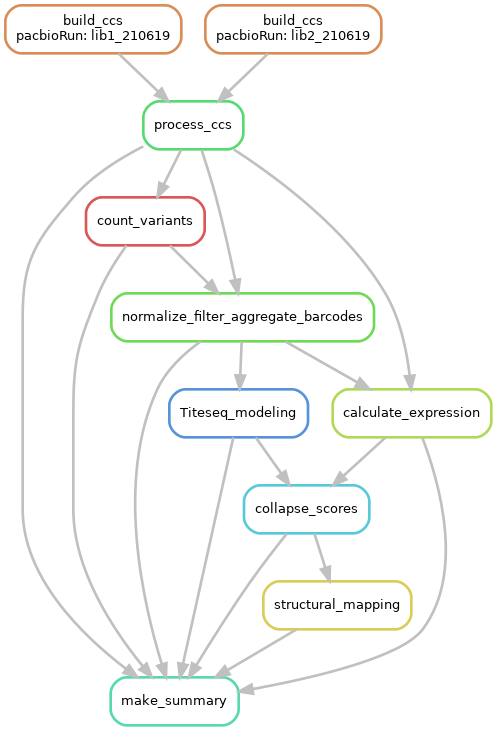

Analysis run by [Snakefile](../../Snakefile)
using [this config file](../../config.yaml).
See the [README in the top directory](../../README.md)

1. [Process PacBio CCSs](process_ccs.md). Creates a [barcode-variant lookup table](../variants/codon_variant_table.csv).
2. [Count variants by barcode](count_variants.md). Creates a [variant counts file](../counts/variant_counts.csv) giving counts of each barcoded variant in each condition.
3. [Normalize, filter, aggregate barcodes](normalize_filter_aggregate_barcodes.md) produces [prepped barcode counts](../aggregated_counts/prepped_barcode_counts.csv) and [prepped variant counts](../aggregated_counts/prepped_variant_counts.csv). These are the barcode and variant counts after merging substitution annotations, normalizing counts, filtering variants, and aggregating (for variant counts) barcode counts.
4. [Tite-seq modeling](Titeseq-modeling.md). This notebook fits a model to the Tite-seq data to estimate the binding affinity (Kd) of each variant to the CGG antibody. The results are recorded in the [variant Kds file](../binding_Kd/variant_binding.csv).
5. [Analyze Sort-seq](compute_expression_meanF.md) to calculate per-variant RBD expression, recorded in [this file](../expression_meanF/variant_expression.csv).
6. [Collapse scores](collapse_scores.md) merges and analyzes the phenotype data. The results are recorded in the final variant scores mut file [here](../final_variant_scores/final_variant_scores.csv).
7. [Map DMS phenotypes to the CGG-bound antibody structure](structural_mapping.md).