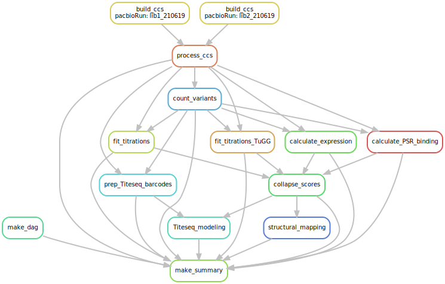

Analysis run by [Snakefile](../../Snakefile)
using [this config file](../../config.yaml).
See the [README in the top directory](../../README.md)

1.  [Process PacBio CCSs](process_ccs.md). Creates a [barcode-variant lookup table](../variants/codon_variant_table.csv).
2.  [Count variants by barcode](count_variants.md). Creates a [variant counts file](../counts/variant_counts.csv) giving counts of each barcoded variant in each condition.
3.  [Prep Titseq Barcodes](prep_Titeseq_barcodes.md) produces [prepped barcode counts](../aggregated_counts/prepped_barcode_counts.csv) and [prepped variant counts](../aggregated_counts/prepped_variant_counts.csv). These are the barcode and variant counts after merging substitution annotations, normalizing counts, filtering variants, and aggregating (for variant counts) barcode counts.
4.  [Tite-seq modeling](../Titeseq_modeling/final_variant_scores.csv). This notebook fits a model to the Tite-seq data to estimate the binding affinity of each variant to the CGG antibody. The results are recorded in [this file](../Titeseq_modeling/final_variant_scores.csv).
5.  [Fit CGG-binding titration curves](compute_binding_Kd.md) to calculate per-barcode KD, recorded in [this file](../binding_Kd/bc_binding.csv).
6.  [Fit TuGG-binding titration curves](compute_binding_Kd_TuGG.md) to calculate per-barcode KD, recorded in [this file](../binding_Kd/bc_binding_TuGG.csv).
7.  [Fit polyspecificity reagent binding Sort-seq](compute_binding_PSR.md) to calculate per-barcode polyspecificity score, recorded in [this file](../PSR_bind/bc_polyspecificity.csv).
8.  [Analyze Sort-seq](compute_expression_meanF.md) to calculate per-barcode RBD expression, recorded in [this file](../expression_meanF/bc_expression.csv).
9.  [Derive final genotype-level phenotypes from replicate barcoded sequences](collapse_scores.md). Generates final phenotypes, recorded in [this file](../final_variant_scores/final_variant_scores.csv).
10. [Map DMS phenotypes to the CGG-bound antibody structure](structural_mapping.md).